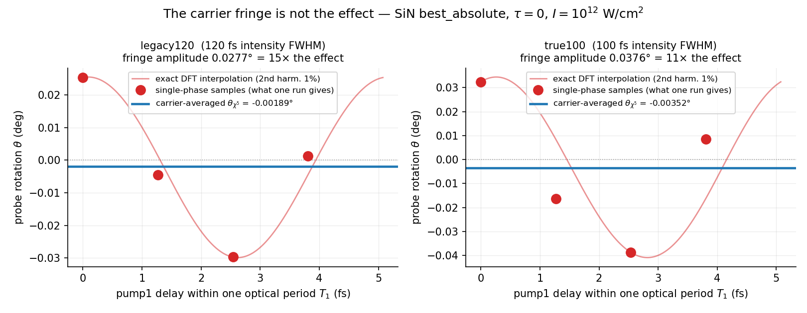
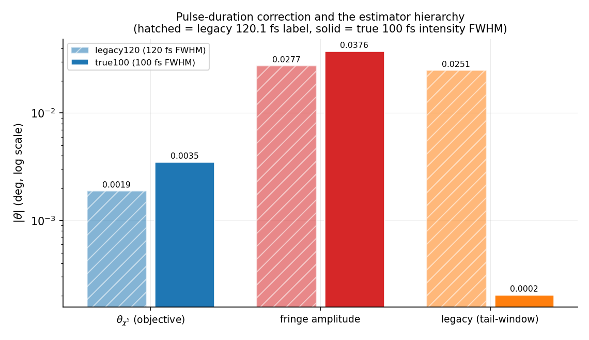
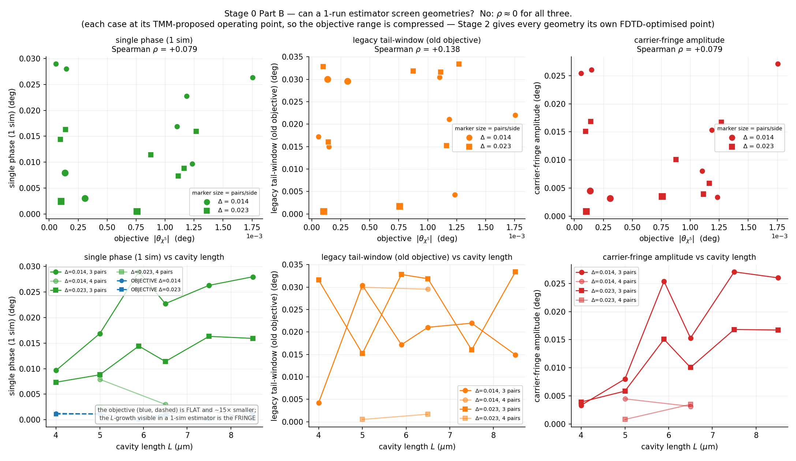
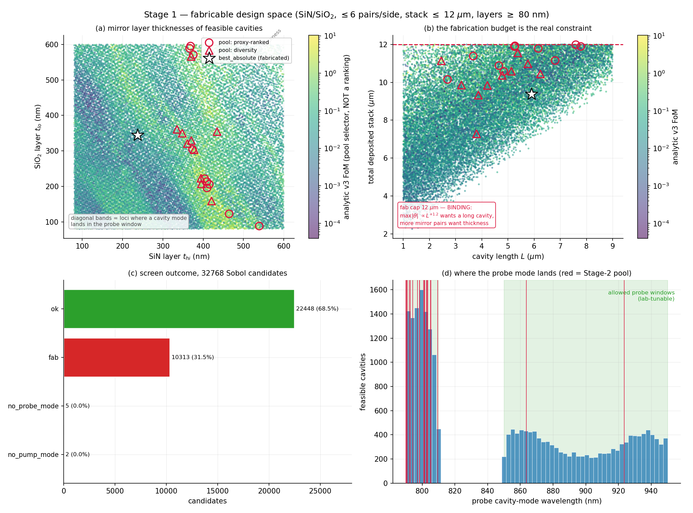
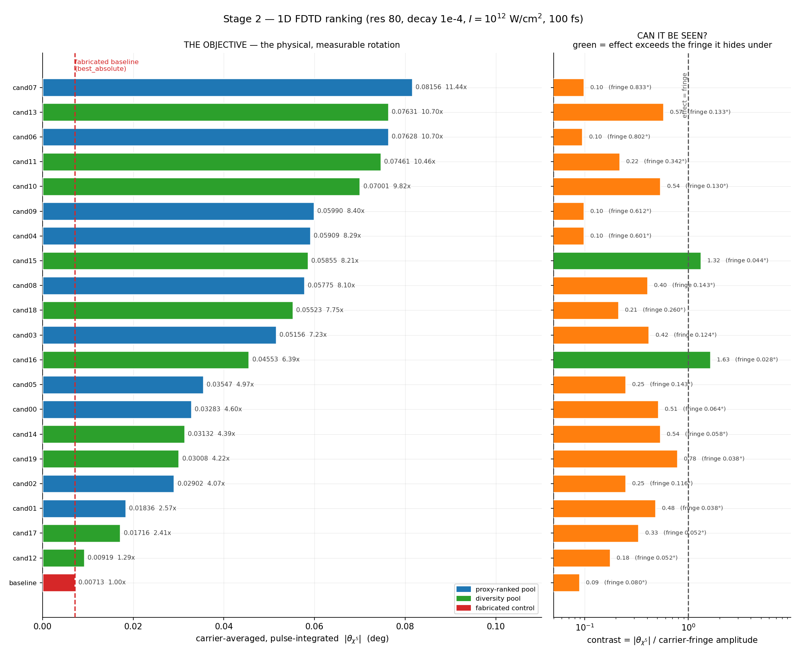
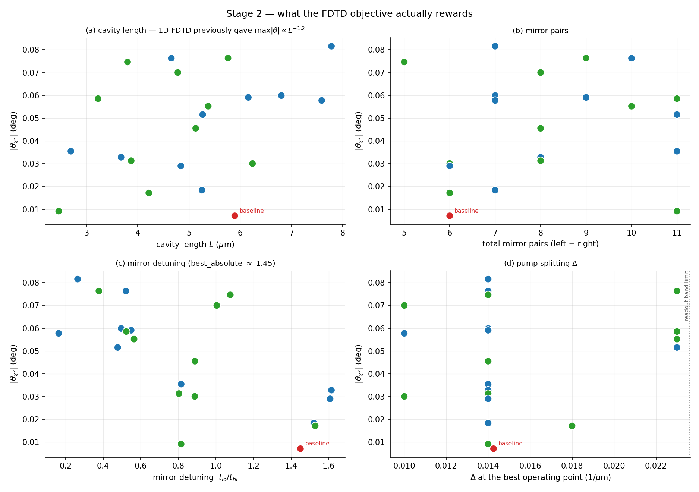
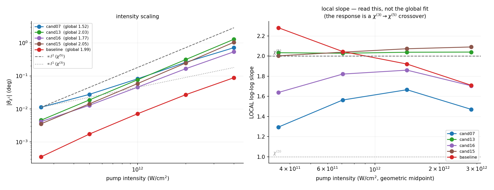
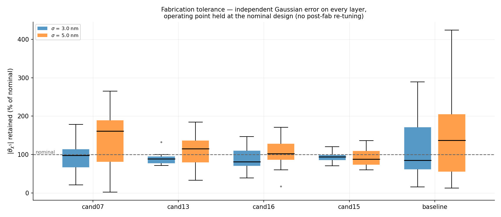
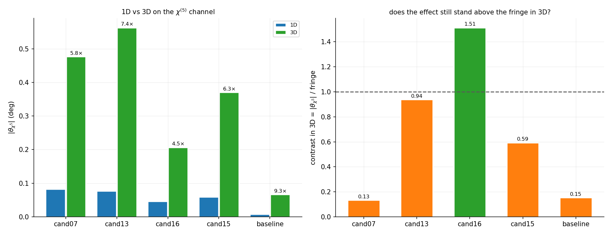
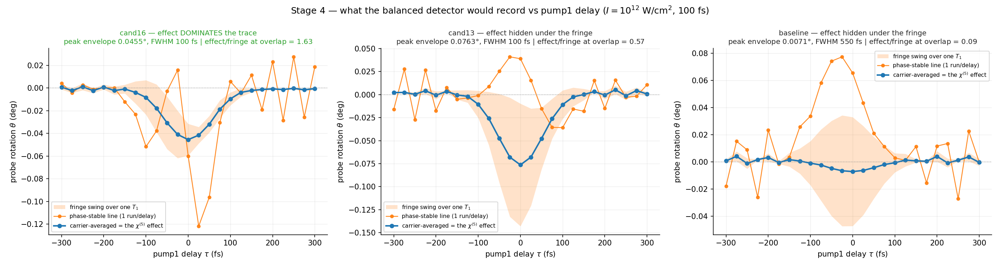

# χ⁽⁵⁾ DBR design campaign — optimizing the cavity for the *measurable* rotation

A from-scratch geometry optimization of the SiN/SiO₂ DBR Fabry–Pérot cavity, targeting the
all-optical χ⁽⁵⁾ Faraday rotation **as a lab-realizable experiment**. Started 2026-08-02.

This is a **separate entity** from `../chi5_optimization/`. That package's machinery (the TMM
engine, the analytic objective, the hybrid driver) is *imported and reused*; nothing in it or in
the base pipeline is modified. The one exception is documented in §6.

> 📄 **[`docs/fringe_vs_effect.md`](docs/fringe_vs_effect.md) — the carrier fringe vs the χ⁽⁵⁾
> effect.** Full derivation of the two-timescale separation, the carrier-average operator, the
> heterodyne/homodyne identification, and every simulation result that establishes them.
> **Read this before quoting any rotation number from this campaign.**

Other documents: [`docs/comparison.md`](docs/comparison.md) (fabricated design vs the optimized
candidates) · [`docs/design_sheets.md`](docs/design_sheets.md) (fab-ready layer stacks).

---

## 1. Why a new campaign

Every previous optimizer in this repo — including the one that produced the **fabricated**
`SiN_optimizations/best_absolute` — maximized

```
probe_rotation_deg.final_relative_deg        at ONE pump carrier phase
```

The 2026-08 experimental audit established that this quantity is wrong twice over:

| axis | what the old objective did | what a detector does |
|---|---|---|
| energy weighting | azimuth of the last few time samples, after the pulse has decayed to ~1e-4 | integrates pulse energy: ∫\|E_V\|²dt − ∫\|E_H\|²dt |
| pump carrier phase | one fixed phase, and τ=0 sits at the **fringe maximum** | averages, unless the delay line is interferometrically stable |

θ = ½·arg(a₊/a₋) is a *ratio*, so it stays finite and keeps accumulating phase through ring-down
as both fields vanish. And underneath it sits a coherent **carrier fringe** ~8× (1D) / ~35× (3D)
larger than the effect, which averages to zero over the optical phase. The published
**0.137° / 1.991°** headline numbers are that fringe maximum. The physical, pulse-integrated,
carrier-averaged χ⁵ rotation of the same design is **0.0034° (1D) / 0.0556° (3D)**.

So the previous searches were hill-climbing a **coherent artifact superposed on the effect**.
This campaign optimizes the effect itself.

## 2. The objective

For a geometry *g* and operating point *(f_probe, f_center, Δ)*:

```
θ_χ5(g, op) = carrier-averaged, pulse-integrated probe rotation
            = angle of  <S>  where <S> = mean Stokes vector over N=4 pump1 delays
                                          τ_s = s·T₁/4,  s = 0..3,  T₁ = λ_pump1/c
```

Delaying pump1 by τ multiplies its field by exp(iω₁τ), so a term carrying *n* powers of E₁ and
*m* of E₁\* picks up exp(i(n−m)ω₁τ). Averaging uniformly over one period **annihilates every
n ≠ m term** and leaves exactly the rectified χ³/χ⁵ response. N = 4 cancels harmonics 1, 2 and 3
— the minimum defensible choice, since the fringe needs a 26% second harmonic to fit (R²=0.996).

Cost: **4 FDTD runs per operating point.** Stage 0 tests whether a 1-run estimator can be
substituted for screening.

The fringe amplitude is retained as a *diagnostic*, via the exact discrete Fourier projection
`2|Σ_k y_k e^{-iφ_k}|/N` — peak-to-peak of 4 samples is biased (√2A…2A, ~30% jitter).

## 3. Design space and constraints

Fabrication limits (user, 2026-08-02) — `best_absolute` was successfully fabricated, so the
PECVD process is known-good:

| constraint | value | why it binds |
|---|---|---|
| materials | SiN / SiO₂ only | measured ellipsometry (`si3n4.csv`, `sio2.csv`), proven recipe |
| mirror pairs | 2–6 per side | deposition time, film stress |
| total stack | ≤ 12 µm | mirrors + cavity |
| layer thickness | ≥ 80 nm | PECVD thickness control, interface roughness |

The stack cap is **binding and interesting**: the validated FDTD trend is max\|θ\| ∝ L^+1.2, so the
optimizer wants a long cavity, while more mirror pairs want thickness. Under a 12 µm budget the
two compete directly. (`best_absolute` uses 9.38 µm: 3 pairs/side + 5.894 µm cavity.)

Free parameters — **5**, one more than any previous search:

```
n_left, n_right ∈ [2, 6]      mirror pairs per side   ← NEW: allowed to differ
t_hi            ≥ 0.080 µm    SiN layer
t_lo            ≥ 0.080 µm    SiO₂ layer
L_cav                         cavity (high-index) length
```

**Why asymmetric mirrors are a new lever.** The derivations (`isotropic_derivation`,
`very_general_derivation`) give rotation = (k₀L/4)·Re[Δχ], ellipticity = Im[Δχ]. A cavity whose
response is *symmetric* about ω_s gives Re[Δχ] = 0 — **pure ellipticity, zero net rotation**.
Net rotation *requires* breaking the ω_s ± Δ symmetry. Unequal mirrors are the most direct
structural way to do it, and no previous search in this repo had the freedom (`build_geometry`
in `chi5_optimization/optimize.py` forces `n_left == n_right`).

Operating point: probe and pumps are **both tunable** in the lab (user), so
probe ∈ {790–810} ∪ [850–950] nm, pumps in the mid-IR 1.40–1.95 µm, Δ = f₁ − f₂ searched.

## 4. The pulse-duration correction ⚠️

The lab pulses are **100 fs FWHM in intensity** (user, 2026-08-02). The simulator's
`pulse_duration_fs` is *not* that quantity:

```
df_from_pulse_duration(T):  amplitude width = T/(2 ln 2)
  ⇒ intensity FWHM = 2√(ln2) · T/(2 ln 2) = T/√(ln2) = 1.2011 · T
```

So the historical label `100.0` is a **120.1 fs** pulse — 20% too long. A true 100 fs intensity
FWHM needs **T = 83.2555 fs**. Consequences, all verified against the simulator:

| quantity | old label 100.0 | true 100 fs (T=83.2555) |
|---|---|---|
| fwidth | 0.046242 /µm | **0.055542 /µm** (+20%) |
| probe DFT readout half-band | 0.023121 /µm | **0.027771 /µm** |
| Q_cap probe / pump | 26.9 / 14.2 | **22.4 / 11.8** |
| baseline Δ=0.0219 as % of half-band | 95% (no margin) | **79%** |

The readout band matters as much as the bandwidth cap: the pulse-integrated Stokes vector sums
the probe DFT bins over `f_probe ± df_probe/2`, so **the FWM sidebands at ±Δ must sit inside it**
or the objective silently loses the signal it is measuring. The delay study ran at 94.9% of the
half-width with "no margin"; the corrected pulse relieves that. Δ is capped at 85% of the
half-band (**Δ ≤ 0.0236**).

## 5. Pipeline

```
s0_harness.py   Stage 0  validate the readout; choose the screening estimator     (72 sims)
s1_screen.py    Stage 1  TMM linear feasibility + coarse pre-rank, wide Sobol     (analytic)
s2_fdtd.py      Stage 2  1D FDTD carrier-averaged operating-point sweep + rank    (the truth)
s3_validate.py  Stage 3  3D, intensity scaling (I² law), fab tolerance            (finalists)
s4_delay.py     Stage 4  the predicted lab trace: V−H vs pump1 delay              (300 sims)
```

Division of labour is the one the 2026-06 campaign established the hard way: **TMM is used only
for what it is validated-accurate at** (mode f₀ to <0.7%, Q to the right order, fields), namely
proposing candidate probe modes and pump centers and pre-filtering on linear feasibility. It is
**not** used to rank geometries or pick the operating point — the analytic χ⁵ FoM was shown to be
*anti-correlated* with FDTD over geometry (Spearman −0.92, proxy ∝L⁻³ vs FDTD ∝L^+1.2), and even
the corrected v2/v3 cannot pick the operating point. **1D FDTD owns both.**

## 6. Modification to the shared pipeline

One purely additive change to `../faraday_meep_fp_circ.py`:

```
--pulse-duration-fs FLOAT    (default None → unchanged 100.0)
```

Overrides `RunParams.pulse_duration_fs`, which sets both source bandwidths and the probe DFT
readout band. Default preserves every historical result exactly. Same pattern as the previously
added `--courant` and `--delay-pad-fs`.

---

# Summary — what to do with this

*(Full evidence in the running log below; fab-ready stacks in `docs/design_sheets.md`.)*

### 1. Free 2× on the sample you already have — no fabrication

`best_absolute` is being driven at the wrong operating point. Moving the pumps from the
as-fabricated **1521.5 / 1574.0 nm** to **1492.6 / 1525.1 nm** (Δ 0.0219 → 0.0143) gives
**2.03× the χ⁵ rotation** in 1D, DoLP unchanged. The top six operating points form a plateau, so
it is a broad optimum. This is the cheapest available experimental gain and needs only a
retune.

### 2. If a new sample is made — pick by what you are limited by

| | **cand13** | **cand15** | **cand16** | cand07 |
|---|---|---|---|---|
| θ_χ5 (1D, 1e12) | 0.0763° (10.7×) | 0.0586° (8.2×) | 0.0455° (6.4×) | 0.0816° (11.4×) |
| **θ_χ5 (3D, 1e12)** | **0.5625° (8.5×)** | 0.3701° (5.6×) | 0.2063° (3.1×) | 0.4765° (7.2×) |
| **contrast** 1D → 3D | 0.57 → **0.94** | 1.32 → 0.59 | **1.63 → 1.51** | 0.10 → 0.13 |
| intensity-law slope | **2.03–2.04** | 2.00–2.09 | 1.64–1.86 | 1.29–1.67 |
| tolerance, σ=5 nm worst | 33% | **60%** | 17% | **2%** |
| DoLP (3D) | 0.757 | **0.862** | 0.699 | **0.233** ⚠️ |
| pumps | **1471 / 1523 nm** | 1674 / 1741 nm | **1512 / 1544 nm** | 1395 / 1423 nm |

* **cand13 — the recommendation.** Highest rotation in 3D (0.56°, 8.5× the baseline), textbook
  I² scaling, second-most fab-robust, contrast rising to 0.94 in 3D, and pumps essentially where
  the lab already operates. Best on every axis that matters except pure contrast.
* **cand16 — the specialist, and the one that removes a procedure.** The only design whose effect
  stands **above** the fringe in 1D (1.63), 3D (1.51) and in the full delay trace (Stage 4). Its
  phase-stable reading has the *same sign* as the truth, so its χ⁵ signal is legible from the raw
  trace **without the delay-dither workaround**. Pumps also lab-compatible.
* **cand15 — the robust one.** Most tolerant to fabrication error by a clear margin, contrast
  1.32, clean I². Its pumps (1674 / 1741 nm) sit well outside the current region, so check the
  OPA range first.
* **cand07 — do not fabricate.** Highest 1D number, but contrast no better than the baseline,
  the worst intensity-law slope, the most fragile of all (a σ=5 nm draw cost 98% of signal), and
  in 3D its DoLP collapses to **0.233** — three quarters of the linear polarisation is gone, so
  the angle is not comparable to the others. It is exactly the design a naive "maximise |θ|"
  objective would have selected, and it fails on every other axis.

### 3. Design rules that generalise

* **Invert the mirror detuning.** ρ(t_lo/t_hi, |θ|) = −0.598 — the strongest lever found. The
  fabricated design uses t_lo/t_hi = 1.45; every winner sits at **0.26–0.81** (thick SiN, thin SiO₂).
* **Put the probe at ~800 nm, not 850–950 nm** — 8/8 geometries, median 4.0×, from near-octave
  matching. Beware: the highest-*Q* probe mode is often the 860 nm one, i.e. the wrong one.
* **Cavity length barely matters** for the physical objective (ρ = +0.38), despite the
  `L^+1.2` rule inherited from legacy-estimator work.

### 4. The choice, concretely

Stage 4 turns the cand13-vs-cand16 decision into a procedural one:

* keep the **delay-dither** procedure → take **cand13**, it has the most signal (8.5× in 3D);
* would rather **not** dither → take **cand16**, the only design whose effect is readable
  straight off the trace, with the correct sign.

Either way the **2× pump retune on the existing sample** is worth doing first — it costs nothing.

### 5. Open question for the lab ⚠️

Everything here assumes **broadband balanced detection** — the detector integrates the whole
transmitted probe spectrum, 785–821 nm. The FWM sidebands at ω_s ± Δ sit 14 nm out from the
carrier and **they are the χ⁵ mechanism**. If the probe arm is spectrally filtered to much
narrower than ±14 nm, it would reject them and measure a different quantity, and the designs
should be re-ranked for that readout. Cheap to redo if the answer is "we filter".

---

# Running log

## Readout verified against the committed delay study ✅

Before any new simulation: this campaign's readout code path (`read_case` → `carrier_average` →
`stokes_to_angles`, including the fringe Fourier projection) was run on the **raw run directories
of the committed delay study** (`chi5_optimization/delay_physics/t+0000.00_s{0..3}_el00.0`) and
reproduces its published τ=0 row exactly:

| quantity | this campaign | committed study | diff |
|---|---|---|---|
| θ_χ5 (carrier-averaged) | −0.001887° | −0.001887° | 1.0e-7 |
| θ_legacy | 0.025231° | 0.025231° | 1.4e-7 |
| fringe amplitude | 0.027705° | 0.027705° | 4.3e-7 |
| DoLP | 0.997014 | 0.997014 | 2.1e-7 |

So the *analysis* is not a source of error, and Stage 0 Part A only has to validate the *run
configuration* (pad, delay convention, pulse label). Pinned as a regression test in
`../tests/test_chi5_dbr_design.py` (the four raw Stokes vectors are embedded, since the run dirs
are gitignored). 10 tests, all passing; no Meep required.

## Stage 0 — harness validation and estimator choice

**Status: running** (SLURM job 53819, 3×40-core cpu nodes, 72 sims, res 80, decay 1e-4, pad 25 fs).

Design:

* **Part A** — baseline `best_absolute` at its design operating point, τ=0, 4 carrier
  sub-samples, at *both* pulse settings. The legacy-pulse run must reproduce the committed
  record (θ_χ5(τ=0) ≈ −0.00189°, legacy fringe-max ≈ 0.138–0.143°); that validates the readout,
  the carrier averaging and the delay convention in one shot. The true-100 fs run then isolates
  what the pulse correction does.
* **Part B** — 16 (geometry, operating point) cases: an L family {4.0, 5.0, 5.894, 6.5, 7.5, 8.5}
  µm at 3 pairs/side plus two 4-pair variants, each at Δ ∈ {0.014, 0.023}. Rank-correlate
  three cheap estimators against the objective.

Pad is 25 fs and **fixed**: every pad > 0 reproduces to 0.23%, but pad = 0 is a +2.1% outlier
(sources turning on exactly at t=0). All historical numbers used pad = 0.

### Part A results ✅ — harness validated, and the pulse correction is not cosmetic



| pulse | intensity FWHM | **θ_χ5 (objective)** | fringe amplitude | legacy | DoLP | fringe/effect |
|---|---|---|---|---|---|---|
| `legacy120` | 120.1 fs | **−0.001887°** | 0.027709° | +0.025133° | 0.99701 | 14.7× |
| `true100` | 100.0 fs | **−0.003519°** | 0.037595° | −0.000203° | 0.99639 | 10.7× |

**1. The harness is correct.** The legacy-pulse arm reproduces the committed record to **0.01%**
on both θ_χ5 (−0.001887 vs −0.001887) and the fringe amplitude (0.027709 vs 0.027705) — despite
running at pad 25 fs against the record's pad 500 fs. That is the predicted behaviour: a common
start-time offset cancels from same-frequency Stokes products, and the carrier average removes
what is left. Delay convention, pad, readout and averaging are all confirmed.

**2. The true 100 fs pulse gives 1.86× more rotation.** θ_χ5 goes −0.00189° → **−0.00352°**
purely from correcting the pulse length. The 20% broader spectrum helps the cascade: the two
σ⁺σ⁻ pumps overlap more (Δ/fwidth 0.474 → 0.395) and the ±Δ sidebands sit further inside the
probe band. The fringe grows only 1.36×, so the **effect-to-fringe ratio improves from 1/14.7 to
1/10.7** — the physical signal is easier to separate at the real pulse length, not harder.

**3. The legacy estimator is not a stable physical quantity — new evidence.** A 20% change in
pulse length moved it from **+0.0251° to −0.0002°**: a sign flip and a 125× collapse, while the
objective moved smoothly by 1.86×. Whatever the tail-window azimuth measures, it is not a
robust property of the design. This is an independent argument for the campaign's estimator
choice, obtained for free.



*(The 2nd-harmonic content of the fringe is only ~1% at τ=0; the delay study's 26% figure was
measured across the whole delay scan. N=4 sub-samples remains the safe choice.)*

### Decay-threshold convergence (side check, 8 sims)

Part B revealed that long-cavity geometries ring down much longer than the baseline (Meep time
600–900 vs 254), which drives the Stage-2 budget. So the decay threshold was checked directly on
the baseline at the true 100 fs pulse:

| `--decay-threshold` | θ_χ5 | vs 1e-4 | t_stop |
|---|---|---|---|
| 1e-3 | −0.003479° | 1.14% | 214 |
| **1e-4** | **−0.003519°** | reference | 254 |
| 1e-5 | −0.003533° | 0.40% | 305 |

Converging to ≈ −0.00353°. **Stage 2 uses 1e-4**: it is within 0.4% of converged, and 1e-3 buys
only 16% shorter runs for a 1.1% bias — not a good trade when ranking designs that may differ by
only tens of percent.

### Part B results ✅ — no cheap screen exists, and the old objective is a different quantity



Rank correlation against the objective, over all **16** geometry/operating-point cases
(72/72 sims complete):

| cheap estimator | Spearman ρ | verdict |
|---|---|---|
| single carrier phase (1 sim) | **+0.079** | different quantity |
| legacy tail-window (**the old objective**) | **+0.138** | different quantity |
| carrier-fringe amplitude | **+0.079** | different quantity |

All three are **≈ 0** — they carry essentially *no rank information* about the physical rotation.
This is not a marginal correlation to be exploited with care; it is the absence of one.

**The mechanism, not just the statistic.** Median fringe/effect = **12.2×**. A single run measures
effect + fringe where the fringe is an order of magnitude larger and varies independently of the
effect, so it cannot rank the effect. The objective changes sign across the family (9 of 16
negative) while 15 of 16 single-phase readings stay positive — the fringe sets both the size and
the sign of what one run reports.

**Consequence for Stage 2:** carrier-average everywhere, 4 sims per operating point. There is no
4× saving available. Budgeted accordingly.

⚠️ **A design rule inherited from earlier work is now in question.** The bottom-left panel shows
the objective is flat in cavity length while single-phase and fringe both *grow* with L. The
established `max|θ| ∝ L^+1.2` rule was measured with the **legacy** estimator, which Part B has
just shown is uncorrelated with the physical objective — so that rule may describe how the
*fringe* scales, not the effect. Stage 2 tests it properly, giving every geometry its own
FDTD-optimised operating point.

**Caveat on the ρ values:** each Part B case sits at its *TMM-proposed* operating point, which is
systematically poor — the baseline scores 0.00352° at its own design point but only ~0.0001° here.
That compresses the objective range and depresses ρ on its own. The mechanistic argument above
(fringe 12× larger, independent, sign-setting) is the load-bearing one; the ρ≈0 is consistent
with it rather than the sole evidence. It also re-confirms that **FDTD must own the operating
point** — a 60× swing on one geometry.

DoLP is 0.9991–0.9999 across every case: these are clean rotations, with no ellipticity
conversion contaminating the comparison.

---

## Stage 1 — fabricable design space ✅

**32768 Sobol candidates, 22448 feasible (68.5%), 10313 rejected on fab limits (31.5%),
7 with no usable probe/pump mode.** ~44 min on one 40-core node.



TMM was first validated against the committed FDTD modes of `best_absolute`: probe 0.30%,
pump1 0.24%, pump2 0.22% frequency error — well inside what mode-proposal needs.

What the space looks like:

* **Panel (a)** — the feasible region is crossed by **diagonal bands** in (t_hi, t_lo) where a
  cavity mode lands inside a probe window. These are the real design manifolds; the pool sits on
  them. `best_absolute` (★) sits on a *lower*-scoring band.
* **Panel (b)** — the **12 µm stack cap is binding**: the proxy-ranked half of the pool presses
  right against it, confirming the L^+1.2 pull is fighting the pair count for the same budget.
* **Panel (d)** — probe modes cluster densely at 790–810 nm and spread thinly over 850–950 nm.

**The pool leans hard on the new asymmetry lever:** 9 of the 10 proxy-ranked geometries have
n_left ≠ n_right (5/3, 5/2, 4/2, 6/5, 6/3, 5/2, 5/2, 5/2 …), and all favour *thicker* SiN
(t_hi ≈ 0.37–0.54 µm vs the baseline's 0.2375). Whether that survives FDTD is exactly what
Stage 2 tests — the proxy scores the pool ~286× the baseline, which is the same pattern that
preceded the 2026-06 refutation, so it is treated as **unranked** until FDTD speaks.

---

## Stage 2 — 1D FDTD carrier-averaged ranking

**Status: running** (SLURM job 53835, 12 array tasks × 26 workers = 312 concurrent, 9 nodes).
21 geometries × 390 operating points × 4 carrier sub-samples = **1560 sims**, res 80, decay 1e-4.

### ⚠️ The operating-point grid had to be rebuilt mid-campaign (two flaws, both found in the data)

The first partial ranking looked spectacular — candidates at "16–64× the baseline" — and that was
the clue that something was wrong: **the baseline was scoring 0.00115°, below its own known
design-point value of 0.00352°.** It was being denied its own operating point. Two causes:

**Flaw 1 — ranking pump centers by Q is meaningless here.** Every pump-band mode of these
cavities has Q ≈ 40–130, while a 100 fs pump can only resolve `Q_cap = f/fwidth ≈ 12`. All modes
are far broader than the pulse, buildup is saturated (the earlier FDTD decomposition measured it
*flat*), and Q therefore says nothing about which center is better. It is not merely
uninformative: `best_absolute` has two anomalously high-Q modes at 1.75/1.87 µm that crowded out
its own 1.547 µm design point (5th by Q). *Fix:* keep 2 top-Q modes and add 3 spread across the
pump band, so every geometry is treated alike (`common.pump_centers`).

**Flaw 2 — the grid could not express the reference design at all.** It straddled pumps about a
single mode (f ± Δ/2), but `best_absolute` puts **each pump on its own mode** (0.6573 and 0.6353,
Δ = 0.0219) with a center that is not a mode. *Fix:* also offer resonant **pairs** with Δ derived
from the pair (`common.pump_pairs`). The design point is now recovered to (0.6448, Δ 0.0218).

**A cost saving that fell out of the same data:** across 8 geometries with both probe windows
evaluated, the **790–810 nm probe beat the 850–950 nm one every single time, median 4.0×** — as
expected from near-octave matching (2·f_pump ≈ 1.30 vs f_probe 1.25, 4% off, against 15% off at
900 nm). Stage 2 now searches only the ~800 nm window, which pays for the extra centers and pairs.
(`probe_modes` sorts by Q and often ranks the 860 nm mode *first*, so the window filter — not a
count — is what selects correctly.)

Grid per geometry: 1 probe × (5 band-covering centers × 4 Δ + up to 4 resonant pairs).

### Stage 2 results ✅



With the corrected grid the baseline finds **0.00713°** — 2.03× its own design-point value — so it
is now being compared fairly. **All 20 candidates beat it**, from 1.29× to 11.44×.

#### ⭐ The two things worth measuring rank almost oppositely

| | best design | value | vs baseline |
|---|---|---|---|
| raw rotation \|θ_χ5\| | **cand07** | 0.0816° | **11.44×** |
| **contrast** = \|θ_χ5\| / fringe | **cand16** | **1.63** | baseline is 0.09 |

cand07 produces 11× more rotation but its fringe grows in step (0.833°), leaving contrast 0.10 —
**no better than the fabricated baseline's 0.09**. It is 11× more effect buried under 11× more
artifact. Two designs instead put the effect *above* the fringe: **cand16 (contrast 1.63)** and
**cand15 (1.32)**. For a lab whose delay line is not interferometrically stable — the situation
the delay study diagnosed — that is the more valuable property, because the χ⁵ signal would
dominate the trace instead of hiding 11× under it. Both families go to Stage 3.

#### 🔬 Immediately actionable: the existing sample is under-driven by 2×

The baseline's best operating point is a **resonant pump pair at 1492.6 / 1525.1 nm (Δ = 0.0143)**,
giving 0.00713° against 0.00352° at the as-fabricated 1521.5 / 1574.0 nm (Δ = 0.0219) — **2.03×
more signal from retuning the pumps alone, no refabrication**, DoLP unchanged at 0.996. The top
six operating points form a plateau (0.0058–0.0071° over centers 0.60–0.67), so this is a broad
optimum, not a knife edge.

#### What FDTD actually rewards (Spearman over the 20 candidates)

| design parameter | ρ vs \|θ_χ5\| | ρ vs contrast |
|---|---|---|
| **mirror detuning t_lo/t_hi** | **−0.598** | +0.248 |
| cavity length L | +0.380 | −0.132 |
| t_hi (SiN thickness) | +0.274 | −0.383 |
| total stack | +0.135 | −0.289 |
| total mirror pairs | +0.085 | −0.015 |
| **mirror asymmetry \|n_L − n_R\|** | **−0.026** | +0.071 |
| Δ at the best point | +0.056 | +0.006 |



* **The dominant lever is mirror detuning, and it runs opposite to the fabricated design.**
  `best_absolute` uses t_lo/t_hi = 1.45 (thick SiO₂); the winners cluster at **0.26–0.81** (thick
  SiN, thin SiO₂). This is the clearest design rule the campaign has produced.
* **Cavity length is only weakly rewarded (+0.38), not the L^+1.2 of the legacy estimator** —
  consistent with the Part B warning that the L rule described the fringe.
* ❌ **My asymmetric-mirror hypothesis is refuted: ρ = −0.026, i.e. nothing.** Unequal mirror
  counts were added on the theoretical ground that a cavity symmetric about ω_s gives
  Re[Δχ] = 0. The winners *are* mostly asymmetric, but asymmetry does not predict performance.
  The likely reason is that these stacks are **never symmetric anyway** — air on one face, SiO₂
  substrate on the other — so the symmetry is already broken and adding more buys nothing. The
  extra degree of freedom cost nothing to include and is now measured rather than assumed.

#### The analytic proxy has no skill — the hedge paid for itself

| pool | n | median \|θ_χ5\| | best |
|---|---|---|---|
| proxy-ranked | 10 | 0.05465 | 0.08156 |
| diversity-sampled | 10 | 0.05038 | 0.07631 |

Statistically indistinguishable, and **Spearman(analytic v3 FoM, FDTD \|θ_χ5\|) = −0.146**. The
corrected v3 objective, which was validated to rank the *legacy* estimator correctly on an
L-family, carries no information about the physical one. Splitting the pool half-and-half is what
makes this measurable instead of a hidden assumption — an all-proxy pool would have produced a
similar winner by luck while leaving the proxy's uselessness undetected.

DoLP is 0.990–0.997 across every winner: clean rotation, not ellipticity conversion.

---

## Stage 3 — validation of the finalists

Finalists chosen on **both** axes (top-2 by θ, top-2 by contrast) plus the fabricated control:
`cand07, cand13, cand16, cand15, baseline`. The list is **frozen** to
`runs/s3_validate/finalists.json` — see the note at the end of this section.

### Intensity scaling ✅ — χ⁵ confirmed, and two designs are textbook



| design | local log-log slopes (2.5e11 → 4e12 W/cm²) | θ_χ5 at 4e12 (1D) | DoLP at 4e12 |
|---|---|---|---|
| **cand13** | **2.03, 2.03, 2.04, 2.04** | **1.288°** | 0.904 |
| **cand15** | **2.00, 2.04, 2.07, 2.09** | 1.049° | 0.926 |
| baseline | 2.28, 2.04, 1.92, 1.71 | 0.088° | 0.935 |
| cand16 | 1.64, 1.82, 1.86, 1.70 | 0.539° | 0.901 |
| cand07 | 1.29, 1.56, 1.67, 1.47 | 0.717° | 0.859 |

cand13 and cand15 sit **flat on slope 2.0 across the whole decade** — pure χ⁵ with no visible
χ³→χ⁵ crossover, cleaner than anything previously measured here (the SiC study climbed 1.2→2.14;
best_absolute gave 1.91 overall). The baseline instead *starts* at 2.28 and rolls off to 1.71,
i.e. it is already saturating by 4e12. DoLP degrades to 0.86–0.94 at 4e12 for everything — that,
not the I² law, is the practical intensity ceiling.

### Fabrication tolerance ✅ — and the fabricated design is the *least* robust



Independent Gaussian error on every layer, **operating point NOT re-tuned** (i.e. the lab does
not re-optimise after fabrication — re-tuning would recover part of the loss). 12 draws each:

| design | σ=3 nm median | 10th pct | worst | σ=5 nm median | 10th pct | **worst** |
|---|---|---|---|---|---|---|
| **cand15** | 94% | 72% | 70% | 88% | **66%** | **60%** |
| **cand13** | 88% | 74% | 72% | 115% | 44% | 33% |
| cand16 | 81% | 61% | 39% | 102% | 63% | 17% |
| baseline | 85% | 45% | 15% | 137% | 28% | 12% |
| cand07 | 98% | 46% | 21% | 161% | 37% | **2%** |

**cand15 is the most robust design and cand13 second**; both keep their whole σ=3 nm distribution
in 70–100%. The raw-signal winner **cand07 is the most fragile** — a σ=5 nm draw took it to **2%**
of nominal — and the **fabricated baseline is nearly as fragile** (12%). Robustness is clearly
not correlated with raw signal, which is exactly why it was worth measuring separately.

Note the medians *above* 100% at σ = 5 nm: |θ| is oscillatory in layer thickness and none of
these nominal points is a local maximum in thickness space, so a random perturbation is as likely
to help as to hurt. A thickness-robust re-optimisation is therefore an available follow-up lever.

### 3D ✅ — the ranking changes again, and one design disqualifies itself



24-rank MPI, res 30, decay 1e-3, same operating points and 4 carrier sub-samples as 1D:

| design | θ_χ5 (3D) | vs baseline (3D) | 3D/1D gain | contrast 1D → 3D | **DoLP (3D)** |
|---|---|---|---|---|---|
| **cand13** | **0.5625°** | **8.48×** | 7.37× | 0.57 → **0.94** | 0.757 |
| cand07 | 0.4765° | 7.19× | 5.84× | 0.10 → 0.13 | **0.233** ⚠️ |
| cand15 | 0.3701° | 5.58× | 6.32× | 1.32 → 0.59 | 0.862 |
| **cand16** | 0.2063° | 3.11× | 4.53× | 1.63 → **1.51** | 0.699 |
| baseline | 0.0663° | 1.00× | 9.30× | 0.09 → 0.15 | 0.655 |

* **cand13 is the best design in 3D** — 0.56°, 8.5× the baseline, and its contrast *improves*
  from 0.57 to **0.94**, i.e. effect and fringe reach near parity.
* **cand16 remains the only design whose effect exceeds the fringe in 3D** (1.51). Its advantage
  is the one that survives dimensionality.
* ⚠️ **cand07 disqualifies itself: DoLP collapses to 0.233 in 3D.** Its "0.477°" is read off a
  beam that has lost three quarters of its linear polarisation, so the number does not mean what
  the others' do. Combined with contrast 0.13 and 2% tolerance survival, cand07 fails on every
  axis except the raw one it was selected for.
* The **baseline gains the most from 3D (9.3×)** but from the lowest base, and its contrast stays
  at 0.15 — it remains a design whose effect is buried.

**DoLP caveat.** 3D DoLP is 0.65–0.86 for all designs (0.23 for cand07) against 0.99+ in 1D.
This is **pre-existing, not introduced here**: the committed 3D delay study reports DoLP = 0.710
for the same baseline geometry. It reflects transverse spatial structure averaged over the
monitor plane at res 30. It is the right observable for a detector collecting the whole beam, but
the low values mean 3D numbers should not be pushed further than a like-for-like comparison.
No 3D intensity sweep was run, so do **not** extrapolate the 3D values with the 1D I² law.

---

## Stage 4 — the predicted lab trace ✅

300 sims: cand16 / cand13 / baseline × 25 delays (±300 fs, step 25) × 4 carrier sub-samples,
pad **350 fs held fixed** so pump1 is the only source whose timing moves for either sign of τ.



Blue = carrier-averaged (a delay line that is not phase-stable, or is deliberately dithered
≥ 5.1 fs) = the χ⁵ effect. Orange = one run per delay, a phase-stable line = fringe + effect,
which is what the current experiment appears to record.

| design | TRUE effect at τ=0 | phase-stable reading at τ=0 | sign | effect/fringe at overlap | envelope FWHM |
|---|---|---|---|---|---|
| **cand16** | −0.0455° | −0.0600° | **same** | **1.63** | 100 fs |
| cand13 | −0.0763° | +0.0389° | **opposite** | 0.57 | 100 fs |
| baseline | −0.0071° | +0.0654° | **opposite** | 0.09 | 550 fs |

* ⭐ **cand16's envelope is the dominant feature of the trace** — a clean single-lobed 100 fs dip
  whose phase-stable reading has the *same sign and the same order of magnitude* as the truth.
  This design's χ⁵ signal is legible from the raw trace **without dithering**.
* ⚠️ **On the fabricated baseline a phase-stable measurement reads the WRONG SIGN and 10.8× too
  large** (+0.077° peak against a true −0.0071°). This is the delay study's diagnosis as a
  picture: the published-style number is not a mis-scaled version of the effect, it is a
  different feature of opposite sign.
* **cand13 also flips sign at τ=0** despite being the largest design — most signal, but it still
  needs the dither.
* Envelope FWHM = **100 fs = the pulse** for both new designs, the signature of a genuine
  two-pump overlap response rather than a cavity artifact. (The baseline's 550 fs is a broad,
  shallow, low-amplitude envelope — do not over-read it at 0.007°.)

**Consistency check:** Stage 4 reproduces Stage 2's contrast numbers exactly (1.63 / 0.57 / 0.09)
from an independent 300-sim scan at a different pad (350 fs vs 25 fs).

*Statistic note:* contrast is quoted **across the pulse overlap (|τ| ≤ 50 fs)**. Averaging the
ratio over all delays is meaningless — in the wings the pulses stop overlapping and the envelope
goes to zero by construction, so effect/fringe collapses there regardless of the design.

### ⚠️ Finalist-list drift (found and fixed)

Stage 2's trailing array tasks each rewrite `s2_result.json` as they finish, and **cand15 and
cand19 tie exactly at contrast 1.32**. An unstable sort tie-break swapped a finalist *after* its
3D jobs had been submitted, so the tolerance array computed cand19 for part of its run. Fixed by
(a) breaking contrast ties by rotation — cand15 wins, same contrast with 1.8× the signal — and
(b) freezing the selection to `finalists.json` on first use. cand15's missing draws were re-run;
cand19's partial data is retained but unused.
