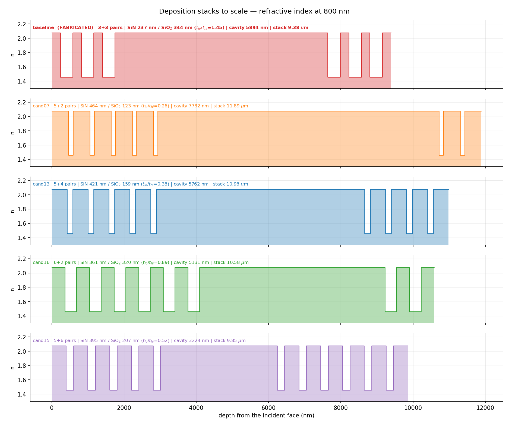
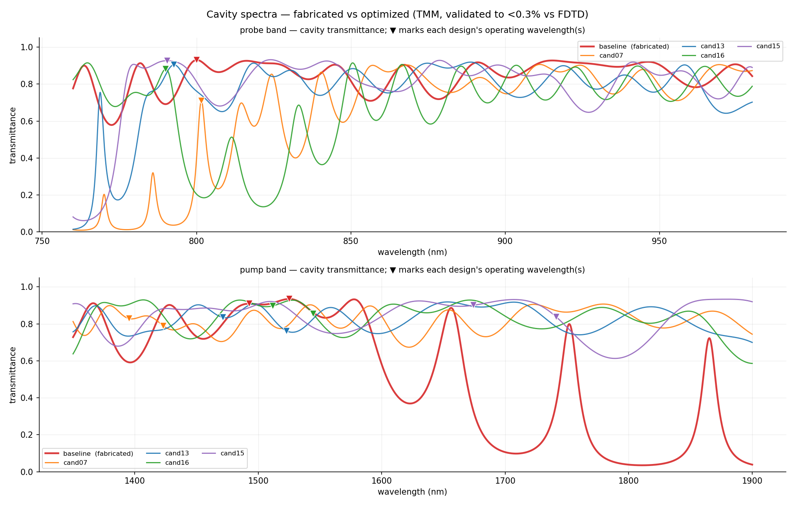

# Fabricated cavity vs optimized designs — detailed comparison

All rotations are the **carrier-averaged, pulse-integrated** χ⁽⁵⁾ rotation at
I_pump = 1e12 W/cm², 100 fs intensity FWHM, balanced σ⁺σ⁻ counter-rotating pumps.
Spectra and mode tables are TMM (validated <0.3% against the committed FDTD modes).

## 1. Geometry

| design | pairs L/R | SiN (nm) | SiO₂ (nm) | t_lo/t_hi | cavity (nm) | stack (µm) |
|---|---|---|---|---|---|---|
| baseline *(fabricated)* | 3 / 3 | 237.5 | 344.2 | **1.45** | 5894 | 9.38 |
| cand07 | 5 / 2 | 464.5 | 122.7 | **0.26** | 7782 | 11.89 |
| cand13 | 5 / 4 | 420.8 | 158.7 | **0.38** | 5762 | 10.98 |
| cand16 | 6 / 2 | 360.8 | 320.5 | **0.89** | 5131 | 10.58 |
| cand15 | 5 / 6 | 395.5 | 207.0 | **0.52** | 3224 | 9.85 |

The **mirror detuning t_lo/t_hi is the single strongest design lever** (Spearman −0.598 against rotation) and the fabricated cavity sits on the wrong side of it: 1.45 (thick SiO₂) against 0.26–0.81 for the optimized designs.

## 2. Operating point

| design | probe (nm) | pump1 (nm) | pump2 (nm) | separation (nm) | Δ (1/µm) |
|---|---|---|---|---|---|
| baseline | 800.1 | 1492.6 | 1525.1 | 32.5 | 0.0143 |
| cand07 | 801.6 | 1395.4 | 1423.2 | 27.8 | 0.0140 |
| cand13 | 792.7 | 1471.4 | 1522.9 | 51.5 | 0.0230 |
| cand16 | 790.0 | 1511.7 | 1544.4 | 32.7 | 0.0140 |
| cand15 | 790.5 | 1674.1 | 1741.2 | 67.0 | 0.0230 |

## 3. Cavity modes (TMM)

**baseline** — probe band: 763.6 nm (Q 94), 781.8 nm (Q 91), 800.1 nm (Q 82) ←probe, 816.2 nm (Q 76), 844.8 nm (Q 76), 867.3 nm (Q 76), 891.1 nm (Q 71), 915.2 nm (Q 66), 946.2 nm (Q 65), 974.5 nm (Q 65)

&nbsp;&nbsp;&nbsp;&nbsp;pump band: 1366 nm (Q 50), 1428 nm (Q 47), 1493 nm (Q 41), 1525 nm (Q 41), 1578 nm (Q 46), 1656 nm (Q 68), 1752 nm (Q 103), 1865 nm (Q 130)

**cand07** — probe band: 770.1 nm (Q 363), 785.9 nm (Q 323), 801.6 nm (Q 239) ←probe, 814.6 nm (Q 137), 824.3 nm (Q 134), 840.4 nm (Q 124), 857.1 nm (Q 103), 868.2 nm (Q 98), 891.8 nm (Q 93), 911.2 nm (Q 92), 924.2 nm (Q 91), 944.6 nm (Q 91), 969.3 nm (Q 86)

&nbsp;&nbsp;&nbsp;&nbsp;pump band: 1380 nm (Q 61), 1409 nm (Q 57), 1447 nm (Q 55), 1496 nm (Q 55), 1542 nm (Q 54), 1591 nm (Q 53), 1654 nm (Q 51), 1723 nm (Q 47), 1779 nm (Q 45), 1868 nm (Q 43)

**cand13** — probe band: 768.8 nm (Q 287), 792.8 nm (Q 109) ←probe, 818.5 nm (Q 99), 830.4 nm (Q 93), 850.6 nm (Q 91), 874.8 nm (Q 87), 888.8 nm (Q 86), 918.8 nm (Q 85), 938.6 nm (Q 82), 958.1 nm (Q 86)

&nbsp;&nbsp;&nbsp;&nbsp;pump band: 1368 nm (Q 57), 1451 nm (Q 51), 1497 nm (Q 50), 1559 nm (Q 48), 1653 nm (Q 44), 1707 nm (Q 43), 1818 nm (Q 41)

**cand16** — probe band: 764.6 nm (Q 99), 780.3 nm (Q 92), 790.0 nm (Q 113) ←probe, 811.4 nm (Q 129), 833.1 nm (Q 125), 850.6 nm (Q 108), 866.6 nm (Q 96), 885.7 nm (Q 89), 903.6 nm (Q 84), 922.7 nm (Q 81), 942.9 nm (Q 79), 964.6 nm (Q 77)

&nbsp;&nbsp;&nbsp;&nbsp;pump band: 1375 nm (Q 51), 1407 nm (Q 49), 1485 nm (Q 46), 1528 nm (Q 45), 1609 nm (Q 43), 1671 nm (Q 41), 1778 nm (Q 39), 1848 nm (Q 39)

**cand15** — probe band: 779.7 nm (Q 107), 790.5 nm (Q 89) ←probe, 824.0 nm (Q 81), 842.2 nm (Q 79), 878.7 nm (Q 77), 897.6 nm (Q 74), 912.5 nm (Q 72), 941.4 nm (Q 74), 956.8 nm (Q 71), 979.3 nm (Q 80)

&nbsp;&nbsp;&nbsp;&nbsp;pump band: 1352 nm (Q 49), 1426 nm (Q 45), 1457 nm (Q 43), 1510 nm (Q 43), 1630 nm (Q 39), 1707 nm (Q 38), 1880 nm (Q 37)

Every pump-band mode has Q ≈ 40–130 while a 100 fs pump only resolves Q_cap = f/fwidth ≈ 12, so **all of them are unresolved by the pulse and the intracavity buildup is saturated** — which is why pump placement is not about hitting a mode centre.

⭐ **The clearest illustration is the fabricated cavity itself.** Its pump-band Q climbs steeply with wavelength — 1493 nm (Q 41), 1525 nm (Q 41) … 1752 nm (Q 103), 1865 nm (Q 130) — because 1700–1870 nm is its mirror stopband (see the deep transmittance minimum in the lower spectra panel). Yet **its best operating point is the pump pair at 1493 / 1525 nm, i.e. on its two LOWEST-Q pump modes**, and the high-Q modes inside the stopband are useless. With buildup saturated, Q carries no information; what matters is the four-wave-mixing and sideband placement. Ranking pump centres by Q — the obvious thing to do — actively selects the wrong ones.

## 4. Rotation

| design | θ_χ5 1D | vs fabricated | θ_χ5 3D | 3D/1D | fringe 1D | **contrast** 1D → 3D | DoLP 1D / 3D |
|---|---|---|---|---|---|---|---|
| baseline | 0.00713° | 1.00× | 0.0663° | 9.3× | 0.08012° | 0.09 → **0.15** | 0.996 / 0.654 |
| cand07 | 0.08156° | 11.44× | 0.4765° | 5.8× | 0.83296° | 0.10 → **0.13** | 0.990 / 0.233 |
| cand13 | 0.07631° | 10.70× | 0.5625° | 7.4× | 0.13298° | 0.57 → **0.94** | 0.994 / 0.757 |
| cand16 | 0.04553° | 6.39× | 0.2062° | 4.5× | 0.02794° | 1.63 → **1.51** | 0.994 / 0.699 |
| cand15 | 0.05855° | 8.21× | 0.3701° | 6.3× | 0.04444° | 1.32 → **0.59** | 0.995 / 0.862 |

`contrast = θ_χ5 / carrier-fringe amplitude` — above 1 the effect is the dominant feature of a delay trace; below 1 it hides under the fringe.

## 5. Nonlinear behaviour

| design | local log-log slopes (2.5e11→4e12) | global | θ at 4e12 (1D) | DoLP at 4e12 | σ=3 nm worst | σ=5 nm worst |
|---|---|---|---|---|---|---|
| baseline | 2.28, 2.04, 1.92, 1.71 | 1.99 | 0.088° | 0.935 | 15% | 12% |
| cand07 | 1.29, 1.56, 1.67, 1.47 | 1.52 | 0.717° | 0.858 | 21% | 2% |
| cand13 | 2.03, 2.03, 2.04, 2.04 | 2.03 | 1.288° | 0.904 | 72% | 33% |
| cand16 | 1.64, 1.82, 1.86, 1.70 | 1.77 | 0.539° | 0.901 | 39% | 17% |
| cand15 | 2.00, 2.04, 2.07, 2.09 | 2.05 | 1.049° | 0.925 | 70% | 60% |

A χ⁽⁵⁾ cascade gives slope 2; χ⁽³⁾ gives 1. The tolerance columns are the worst of 12 independent Gaussian layer-error draws, with the operating point held fixed (no post-fabrication re-tuning).

## 6. Predicted delay trace

| design | true effect at τ=0 | phase-stable line reads | sign | effect/fringe at overlap |
|---|---|---|---|---|
| baseline | -0.00713° | +0.06537° | **OPPOSITE** | 0.09 |
| cand13 | -0.07631° | +0.03886° | **OPPOSITE** | 0.57 |
| cand16 | -0.04555° | -0.05999° | same | 1.63 |

