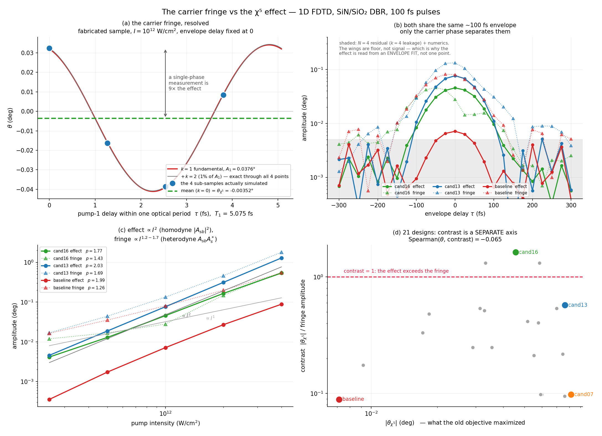

# The carrier fringe vs the χ⁽⁵⁾ effect

*Derivation, measurement protocol, and the simulation evidence.*

> **The one-sentence version.** Delaying a pump changes two things at once — a ~100 fs envelope
> overlap and a ~5 fs carrier phase. The quantity we want (the rectified χ⁽⁵⁾ Faraday rotation)
> depends only on the first; a coherent artifact ~12× larger depends on both. Averaging the Stokes
> vector over one optical period of the delayed pump annihilates the artifact exactly and leaves
> the effect. **Every rotation number in this project that predates 2026-08-02 skipped that step.**



---

## Contents

1. [Setup and notation](#1-setup-and-notation)
2. [The delay enters twice](#2-the-delay-enters-twice)
3. [The expansion theorem](#3-the-expansion-theorem)
4. [What the two terms physically are](#4-what-the-two-terms-physically-are)
5. [Why the leading rectified term is fifth order](#5-why-the-leading-rectified-term-is-fifth-order)
6. [The carrier-average operator](#6-the-carrier-average-operator)
7. [Estimating the fringe amplitude](#7-estimating-the-fringe-amplitude)
8. [What the detector integrates](#8-what-the-detector-integrates)
9. [Simulation evidence](#9-simulation-evidence)
10. [Design consequences](#10-design-consequences)
11. [Experimental prescription](#11-experimental-prescription)
12. [Pitfalls — mistakes actually made in this project](#12-pitfalls--mistakes-actually-made-in-this-project)
13. [Reproducing every number here](#13-reproducing-every-number-here)

---

## 1. Setup and notation

A SiN/SiO₂ DBR Fabry–Pérot cavity is driven by three co-propagating pulses:

| beam | polarization | carrier | envelope | intensity |
|---|---|---|---|---|
| pump 1 | σ⁺ (circular) | ω₁ ≈ 2πc/1.52 µm | A₁(t), 100 fs FWHM | 10¹² W/cm² |
| pump 2 | σ⁻ (circular) | ω₂ = ω₁ − Δ | A₂(t), 100 fs FWHM | 10¹² W/cm² |
| probe | linear, +45° | ω_s ≈ 2πc/0.80 µm | A_s(t), 100 fs FWHM | 5×10⁷ W/cm² (weak) |

The pump pair is centred at f_c with **splitting Δ**: f₁ = f_c + Δ/2, f₂ = f_c − Δ/2. Following
Meep's convention (a = 1 µm) all frequencies and Δ are quoted in **µm⁻¹**, so λ = 1/f.

Real fields are written with slowly-varying complex envelopes,

```
E(t) = Re[ Ã(t) e^{-iωt} ]
```

The measured quantity is the **balanced-detector signal** behind a polarizing beamsplitter oriented
at 0°/90°:

```
V − H  =  −S₁  =  ∫ ( |E_V(t)|² − |E_H(t)|² ) dt
```

and the reported rotation is the azimuth of the pulse-integrated Stokes vector relative to the 45°
launch:

```
θ = ½ arctan2(S₂, S₁) − 45°
```

Two timescales matter throughout:

```
T₁ = λ₁/c   = 5.075 fs      pump-1 optical period      ← the FRINGE lives here
τ_p         = 100 fs        pulse intensity FWHM       ← the EFFECT lives here
```

They differ by a factor of ~20. That gap is the entire basis of the separation.

---

## 2. The delay enters twice

Scan the pump-1 delay τ. The delayed real field is

```
E₁(t−τ) = Re[ A₁(t−τ) e^{-iω₁(t−τ)} ]
        = Re[ A₁(t−τ) · e^{iω₁τ} · e^{-iω₁t} ]
                └────┬────┘  └──┬──┘
             envelope shift   carrier phase
             scale: 100 fs    scale: T₁ = 5.075 fs
```

So the complex envelope transforms as

```
Ã₁(t) ⟶ Ã₁(t−τ) · e^{iφ},        φ ≡ ω₁τ
```

**These are independent handles on the same physical variable.** Over a 5 fs excursion the
envelope overlap is unchanged to O((T₁/τ_p)²) ≈ 0.3%, while φ runs through a full 2π. That is what
makes the separation clean and, in simulation, essentially exact.

---

## 3. The expansion theorem

The transmitted probe-band field is a nonlinear functional of the three inputs; the Stokes
components are bilinear in that field. Expanding perturbatively, every contribution to any Stokes
component is a monomial

```
Ã₁ⁿ Ã₁*ᵐ Ã₂ᵖ Ã₂*ᵍ Ã_sʳ Ã_s*ᵘ
```

and under the delay each such monomial acquires **exactly** the factor

```
e^{i(n−m) ω₁ τ}  =  e^{i(n−m)φ}
```

because only pump 1 is delayed. Grouping monomials by k ≡ n − m gives the central result:

> **Expansion theorem.** For fixed envelope delay, every Stokes component of the transmitted probe
> is a Fourier series in the pump-1 carrier phase φ:
> ```
> S(τ, φ)  =  Σ_{k∈ℤ}  C_k(τ) e^{ikφ},        C_{−k} = C_k*   (S real)
>
>          =  C₀(τ)  +  2 Σ_{k≥1} |C_k(τ)| cos(kφ + arg C_k)
>             ──┬──     ─────────────────┬─────────────────
>            EFFECT                   FRINGE
>            n = m                     n ≠ m
>            rectified                 coherent / interferometric
>            survives cycle-average    averages to zero
> ```

Both `C₀` and `C_k` are envelope-overlap integrals, so **both vanish when the pulses stop
overlapping**. The fringe is *not* a background sitting outside the signal window — it has the same
~100 fs envelope, the same peak position, and the same qualitative shape. Panel (b) of the figure
shows this directly. **They are separable only in the carrier phase.**

This is why no amount of delay-windowing, baseline subtraction, or envelope gating can remove the
fringe. Only phase averaging can.

---

## 4. What the two terms physically are

The identification is concrete. χ⁽³⁾ four-wave mixing writes a **sideband** onto the probe at
ω_s + (ω₁ − ω₂):

```
Ã_sb  ∝  χ⁽³⁾ Ã₁ Ã₂* Ã_s          (n = 1, m = 0  ⟹  k = +1)
```

The detector is quadratic, so `|Ã_s + Ã_sb|²` splits into two pieces with *different* k:

| term | pump-field order | k | intensity scaling | name |
|---|---|---|---|---|
| `2 Re[ Ã_sb Ã_s* ]` | 2 (χ⁽³⁾) | ±1 | ∝ I | **fringe** — *heterodyne* |
| `\|Ã_sb\|²` | 4 (χ⁽⁵⁾-scale) | 0 | ∝ I² | **effect** — *homodyne* |

So the fringe is not a different physical process from the effect — it is **the same sideband, read
out at first order instead of second, amplified by the large probe carrier acting as a local
oscillator.** In the small-signal limit,

```
fringe / effect  ≈  2 |Ã_s| / |Ã_sb|   ≫ 1
```

Five consequences follow immediately, and all five are confirmed below:

1. **The fringe dominates** at accessible intensities (measured median 12.2×, §9.2).
2. **Contrast grows with intensity**, since effect/fringe ∝ |Ã_sb| ∝ I (§9.3).
3. **A single-phase measurement has a random sign** — it reads `C₀ + 2|C₁|cos(φ + arg C₁)`, and
   with |C₁| ≫ |C₀| the sign is set by the fringe phase, not by the physics (§9.2).
4. **The sidebands must lie inside the detection band**, or both terms are silently lost (§8).
5. **Cavity geometry can suppress the fringe independently of the effect**, by arranging
   destructive interference among the several k=±1 contributions (§10).

---

## 5. Why the leading rectified term is fifth order

There *is* a k=0 term at third order. A σ⁺ pump induces different cross-phase modulation on the σ⁺
and σ⁻ components of the probe, i.e. a circular birefringence:

```
Δn₊ − Δn₋  ∝  χ⁽³⁾ ( |A₁|² − |A₂|² )          (k = 0, third order)
```

With **balanced counter-rotating pumps**, |A₁|² = |A₂|² and this cancels identically. That
cancellation is the selection rule the whole experiment is built on: it removes the third-order
rotation and promotes

```
θ_χ5  ∝  χ⁽⁵⁾ ∫ |A₁(t−τ)|² |A₂(t)|² dt  ×  𝒟(Δ)
```

to leading rectified order. The factor `𝒟(Δ)` is forced by symmetry: the configuration is invariant
under the *simultaneous* exchange (σ⁺ ↔ σ⁻, ω₁ ↔ ω₂), so a nonzero rotation requires the pump pair
to be spectrally *inequivalent*. Hence `𝒟(Δ) → 0` as Δ → 0, and it falls again once the sidebands
leave the cavity linewidth and the detection band. **There must be an interior optimum in Δ**, and
there is (§9.6).

Two testable fingerprints of this structure, both confirmed:

- the τ-dependence of the effect is the **pump–pump intensity cross-correlation**, not a field
  correlation — hence a smooth, non-oscillatory ~100 fs peak at τ = 0 (§9.4);
- the intensity exponent is **2**, not 1 (§9.3).

---

## 6. The carrier-average operator

Sample N pump-1 delays at uniformly spaced carrier phases within one period:

```
τ_j = τ₀ + j·T₁/N,     φ_j = 2πj/N,     j = 0 … N−1
```

Apply the discrete orthogonality relation

```
(1/N) Σ_{j=0}^{N−1} e^{ikφ_j}  =  { 1   if k ≡ 0 (mod N)
                                  { 0   otherwise
```

to the expansion theorem:

> **Averaging result.**
> ```
> ⟨S⟩_N  =  (1/N) Σ_j S(τ, φ_j)  =  C₀(τ)  +  Σ_{k≠0, k≡0 mod N} C_k(τ)
>                                    ──┬──     ────────┬─────────
>                                   the effect      residual leakage
> ```

With **N = 4** the harmonics k = 1, 2, 3 are annihilated exactly and the first surviving
contamination is k = 4.

**How pure is the fringe in practice?** For a pure fundamental sampled at 4 uniform phases, the
peak-to-peak spread is bounded: ptp/A₁ ∈ [√2, 2]. Anything above 2 requires higher harmonics. Over
the delay study's signal region (|τ| ≤ 100 fs) the **pulse-integrated** channel gives

```
ptp / A₁  =  1.807 … 2.007      (median 1.964)      ← at the pure-sinusoid bound
```

so on the observable we actually use, the fringe *is* a pure k=1 fundamental to within measurement
error, and the directly measured second harmonic at the fabricated sample's operating point is only
**1.0% of A₁** (§7). The **legacy** tail-window channel is a different story — it reaches
ptp/A₁ = 2.832, i.e. genuine harmonic contamination — one more reason not to use it.

**So why N = 4 and not N = 2?** Not because k=2 was measured to be large on this channel. Because
N = 2 cancels only *odd* harmonics, so it would rest the entire result on the assumption of
fundamental purity, verified above but operating-point dependent and not guaranteed for a new
geometry. N = 3 kills k = 1, 2 but leaks at k = 3. N = 4 kills k = 1, 2, 3 outright for the same
cost as N = 3, and turns a verified assumption into an unnecessary one.

### Three implementation rules

**(i) Average the Stokes vector, not the angle.** S₁, S₂, S₃ are the quantities that are linear in
the field bilinears and therefore obey the expansion theorem. θ = ½arctan2(S₂,S₁) is a nonlinear
function of them; averaging angles does not cancel the fringe. Implemented in
`common.py:carrier_average` — the mean is taken component-wise on (S₀,S₁,S₂,S₃) and converted to an
angle afterwards.

**(ii) Sample within one period, not across many.** Sampling at whole *multiples* of T₁ gives
φ_j ≡ 0 for all j — it freezes the fringe at one phase instead of averaging it. This is the single
easiest way to get a wrong number and it looks like a perfectly reasonable delay scan.

**(iii) The residual is a floor, not a signal.** In the Stage 4 wings (|τ| > 150 fs, where C₀ ≈ 0)
the averaged trace sits at 0.0004–0.004° against a τ=0 peak of 0.0071° for the fabricated sample.
That scatter is k=4 leakage plus numerics (per-point numerical systematic of the pulse-integrated
readout: **0.23%**). It is why significance must come from an **envelope fit over the whole scan**,
never from a single delay point — the 42σ confirmation of the effect in the 3D delay study
(`../chi5_optimization/delay_physics.md`) was obtained that way, and an earlier attempt to read it
from point scatter produced a false "consistent with zero" on the same 6.2σ data.

---

## 7. Estimating the fringe amplitude

The fringe is retained as a diagnostic, via the **exact discrete Fourier projection** onto k = 1:

```
A₁ = 2 |Σ_j y_j e^{-iφ_j}| / N,        ψ = arg( Σ_j y_j e^{-iφ_j} )
```

Do **not** use peak-to-peak as the *estimator*. With N = 4 samples, ptp is biased between √2·A₁ and
2·A₁ depending on where the sampling phases land relative to ψ — roughly 30% jitter — and it buries
weak envelopes.

It is, however, a good **diagnostic**: those same bounds mean ptp/A₁ must lie in **[1.414, 2.000]**
for a pure fundamental, so a value above 2 is direct evidence of higher harmonics and of the
adequacy (or not) of the chosen N. Used this way in §6.

With N = 4 the four real samples determine four harmonic degrees of freedom exactly: c₀ (1),
c₁ (complex, 2), c₂ (real, 1). The reconstruction

```
y(φ) = c₀ + 2|c₁| cos(φ + arg c₁) + c₂ cos 2φ
```

passes through all four points identically — this is the grey curve in panel (a).

**Worked example** (fabricated sample, true 100 fs, I = 10¹², τ = 0). The four simulated
sub-samples are

```
θ_sub = [ +0.032374,  −0.016240,  −0.038650,  +0.008441 ]  deg
```

```
c₀ = mean                              = −0.0035189°     ← the effect
Σ_j y_j e^{-iφ_j} = (y₀−y₂) + i(y₃−y₁) = 0.071024 + 0.024681i
A₁ = 2|·|/4                            =  0.037595°      ← the fringe
c₂ = (y₀−y₁+y₂−y₃)/4                   =  0.000381°      ← 1.0% of A₁
```

The fringe is **10.7× the effect**, and the single-phase reading at j=0 (+0.0324°) is **9.2× the
effect and of the opposite sign.**

---

## 8. What the detector integrates

The readout band is set in `faraday_meep_fp_circ.py:716`:

```python
nfreq_probe = 15
probe_freqs = np.linspace(freq_probe - 0.5*df_probe, freq_probe + 0.5*df_probe, nfreq_probe)
```

with `df_probe = df_from_pulse_duration(pulse_label_fs)`. At the campaign's true-100 fs setting
(label 83.2555 fs ⇒ fwidth = 0.055542 µm⁻¹):

| probe centre | readout band | full width | bin spacing |
|---|---|---|---|
| 800.1 nm | 782.71 – 818.28 nm | 35.57 nm (±17.79) | 2.54 nm |
| 867.3 nm | 846.90 – 888.71 nm | 41.80 nm (±20.90) | 2.98 nm |

The band is proportional to the probe centre, so it is always **3.77× the transform-limited probe
bandwidth** (9.42 nm intensity FWHM at 800 nm). In σ units the half-band is **4.44 σ_I**, capturing
**99.999%** of the probe energy.

`pulse_integrated_probe_stokes()` (line 1224) takes Ex, Ey, Hx, Hy at each of the 15 frequencies,
extracts the **forward-propagating** component via E/H separation, concatenates, and forms the
Stokes vector. Products are therefore same-frequency only, so by Parseval

```
S₁ = ∫|E_V|²dt − ∫|E_H|²dt        (over the band)
```

and the readout introduces **no interferometric artifact of its own** — every fringe discussed here
is physical, not an artifact of how we look.

⚠️ **The FWM sidebands at ω_s ± Δ must stay inside this band**, which is what caps

```
Δ ≤ 0.85 × (fwidth/2) = 0.02361 µm⁻¹        (common.py:DELTA_MAX_INBAND)
```

| operating point | Δ (µm⁻¹) | sideband offset @800 nm | % of half-band |
|---|---|---|---|
| as-fabricated | 0.0219 | ±14.0 nm | 79% |
| best accessible retune | 0.0160 | ±10.2 nm | 58% |
| cand13 | 0.0180 | ±11.5 nm | 65% |
| cand16 | 0.0230 | ±14.7 nm | 83% |

⚠️ **Open question to the lab.** All of this assumes **broadband balanced detection** across ~±18 nm.
A bandpass filter narrower than ±14 nm in the probe arm would reject the sidebands and measure a
different quantity entirely — and would change the design ranking, hitting cand16 (Δ = 0.0230)
hardest. *Is the probe arm spectrally filtered before the balanced detector, and if so, how wide?*

### Aside: the pulse-duration label is not the pulse duration

`df_from_pulse_duration(T)` sets the Gaussian **amplitude** width to T/(2 ln 2), so the **intensity**
FWHM is T/√(ln 2) = 1.2011·T. The historical label `100.0` is therefore a **120.1 fs** pulse. A true
100 fs intensity FWHM needs label **T = 83.2555**, passed via `--pulse-duration-fs`.

This matters twice, because the label sets both the source bandwidths and the readout band:

| | label 100.0 (120.1 fs) | true 100 fs |
|---|---|---|
| fwidth | 0.046242 µm⁻¹ | **0.055542 µm⁻¹** |
| readout half-band | 0.023121 µm⁻¹ | **0.027771 µm⁻¹** |
| Q_cap probe / pump | 26.9 / 14.2 | **22.4 / 11.8** |
| θ_χ5 (fabricated, τ=0) | −0.0018869° | **−0.0035189°** |
| fringe amplitude | 0.027709° | 0.037595° |
| fringe / effect | 14.7 | **10.7** |

Correcting it raises the effect **1.86×** while the fringe grows only **1.36×**, so the contrast
*improves* by 1.37×. This is a bandwidth effect, not an energy effect — peak intensity is fixed, and
the shorter (lower-energy) pulse gives the larger signal because the σ⁺/σ⁻ pumps overlap more
spectrally.

---

## 9. Simulation evidence

All 1D unless stated: resolution 80, `--decay-threshold 1e-4`, dispersive 2-pole fits of measured
SiN/SiO₂ ellipsometry, I_pump = 10¹² W/cm², N = 4 sub-samples.

### 9.1 The fringe, resolved

Panel (a). Four sub-samples across one T₁ = 5.075 fs on the fabricated sample, at fixed envelope
delay τ = 0. Numbers in §7. The four points span **0.071° peak-to-peak** about a mean of
**−0.0035°**: moving the delay stage by 2.5 fs — 380 nm of optical path — swings the apparent
rotation through 20× the entire quantity being measured, and reverses its sign twice.

### 9.2 No single-phase estimator carries rank information

Stage 0 Part B: 16 geometry × operating-point cases, each run at 4 carrier phases, scoring the
carrier-averaged pulse-integrated objective against the cheap alternatives.

| estimator | Spearman ρ vs the physical objective |
|---|---|
| single carrier phase, pulse-integrated | **+0.079** |
| legacy tail-window azimuth, single phase | **+0.138** |
| fringe amplitude | **+0.079** |

All ≈ 0. Not "weakly correlated" — *absent*. The mechanism is the sign scrambling predicted in §4:

```
fringe/effect ratio:   median 12.19,  range 2.70 – 429
objective sign:        9/16 negative,  7/16 positive
single-phase sign:    15/16 positive,  1/16 negative
sign agreement:        8/16  = chance
```

Full table:

| case | θ_χ5 (deg) | single-phase | fringe | fringe/effect |
|---|---|---|---|---|
| n3_L4.00_d0.014 | −0.00124 | +0.00966 | 0.00334 | 2.7 |
| n3_L4.00_d0.023 | +0.00111 | +0.00734 | 0.00392 | 3.5 |
| n3_L5.00_d0.014 | +0.00110 | +0.01686 | 0.00801 | 7.3 |
| n3_L5.00_d0.023 | +0.00116 | +0.00880 | 0.00585 | 5.0 |
| n3_L5.89_d0.014 | −0.00006 | +0.02895 | 0.02539 | 429 |
| n3_L5.89_d0.023 | −0.00010 | +0.01443 | 0.01507 | 155 |
| n3_L6.50_d0.014 | +0.00119 | +0.02272 | 0.01530 | 12.9 |
| n3_L6.50_d0.023 | +0.00088 | +0.01140 | 0.01006 | 11.5 |
| n3_L7.50_d0.014 | −0.00176 | +0.02631 | 0.02708 | 15.4 |
| n3_L7.50_d0.023 | −0.00014 | +0.01632 | 0.01682 | 119 |
| n3_L8.50_d0.014 | +0.00015 | +0.02798 | 0.02601 | 174 |
| n3_L8.50_d0.023 | −0.00127 | +0.01592 | 0.01673 | 13.2 |
| n4_L5.00_d0.014 | −0.00014 | +0.00792 | 0.00448 | 32.6 |
| n4_L5.00_d0.023 | −0.00010 | +0.00243 | 0.00081 | 7.8 |
| n4_L6.50_d0.014 | +0.00031 | +0.00301 | 0.00314 | 10.1 |
| n4_L6.50_d0.023 | −0.00076 | −0.00047 | 0.00349 | 4.6 |

**Consequence for optimization:** there is no 4× saving available from screening candidates with
one simulation. Every stage of the design campaign pays the full 4× carrier-averaging cost. It also
means every design conclusion established with the older single-phase estimator has to be re-checked
— two of them flipped (see §12).

### 9.3 Intensity scaling confirms heterodyne vs homodyne

Panel (c). Stage 3, five intensities from 2.5×10¹¹ to 4×10¹² W/cm², power-law fits |θ| ∝ Iᵖ:

| design | p(effect) | p(fringe) | p(effect) − p(fringe) | contrast @2.5e11 → @4e12 |
|---|---|---|---|---|
| baseline (fabricated) | 1.99 | 1.26 | 0.73 | 0.02 → 0.16 |
| cand13 | 2.03 | 1.69 | 0.35 | 0.27 → 0.72 |
| cand15 | 2.05 | 1.49 | 0.56 | 0.28 → **1.25** |
| cand16 | 1.77 | 1.43 | 0.35 | 0.35 → **0.96** |
| cand07 | 1.52 | 1.19 | 0.33 | 0.06 → 0.14 |

The effect is clean I² for baseline, cand13 and cand15, exactly as §5 requires. The fringe exponent
lands at 1.2–1.7 rather than exactly 1 — the k=±1 channel also collects χ⁽⁵⁾-order contributions, so
it is a mixture, and the two-term model of §4 is leading-order only. But the **sign and rough size
of the gap are as predicted**, and contrast does rise with intensity.

⚠️ It does not rise fast enough to rescue the fabricated sample: even at 4×10¹² W/cm² its contrast
is still only **0.16**. Turning up the power is not a route out of the fringe on that geometry.

### 9.4 The delay trace: same envelope, different phase behaviour

Panel (b). Stage 4, τ ∈ [−300, +300] fs in 25 fs steps, 4 sub-samples per point (100 sims/design),
fixed 350 fs pad so run length does not vary with τ.

| design | T₁ (fs) | effect @τ=0 | fringe @τ=0 | contrast (median, \|τ\| ≤ 50 fs) |
|---|---|---|---|---|
| cand16 | 5.043 | 0.04555° | 0.02794° | **1.63** |
| cand13 | 4.908 | 0.07631° | 0.13298° | 0.57 |
| baseline | 4.979 | 0.00713° | 0.08012° | 0.09 |

Both channels peak at τ = 0 with a ~100 fs FWHM envelope — the pump–pump intensity cross-correlation
predicted in §5. The contrast values reproduce the independent Stage 2 ranking **exactly**
(1.63 / 0.57 / 0.09), which is a useful consistency check across two separately-run stages.

Full baseline trace (the shape a lab scan would produce, if it could resolve the carrier):

| τ (fs) | −300 | −200 | −150 | −100 | −50 | −25 | **0** | +25 | +50 | +100 | +150 | +300 |
|---|---|---|---|---|---|---|---|---|---|---|---|---|
| effect | 0.0007 | 0.0032 | 0.0016 | 0.0009 | 0.0048 | 0.0065 | **0.0071** | 0.0063 | 0.0043 | 0.0007 | 0.0008 | 0.0004 |
| fringe | 0.0023 | 0.0059 | 0.0102 | 0.0325 | 0.0700 | 0.0815 | **0.0801** | 0.0655 | 0.0456 | 0.0141 | 0.0026 | 0.0051 |

Note the fringe peaks at τ = −25 fs, not 0 — its `arg C₁` drifts slowly with envelope delay. A
single-phase scan would report a peak position offset from the true zero.

### 9.5 Contrast is an axis orthogonal to raw rotation

Panel (d). Stage 2, 21 candidate designs ranked on both quantities:

```
Spearman( |θ_χ5| , contrast )  =  −0.065        (n = 21)
```

Rank shifts are dramatic — cand07 is **1st on θ but 18th on contrast**; cand16 is **12th on θ but
1st on contrast**. The two notions of "best" pick genuinely different geometries. Extract:

| design | θ_χ5 (deg) | fringe (deg) | contrast | rank on θ | rank on contrast |
|---|---|---|---|---|---|
| cand07 | 0.08156 | 0.83296 | 0.10 | 1 | 18 |
| cand13 | 0.07631 | 0.13298 | 0.57 | 2 | 4 |
| cand15 | 0.05855 | 0.04444 | 1.32 | 8 | 3 |
| cand16 | 0.04553 | 0.02794 | **1.63** | 12 | **1** |
| cand19 | 0.03322 | 0.02519 | 1.32 | 14 | 2 |
| baseline | 0.00713 | 0.08012 | 0.09 | 21 | 21 |

### 9.6 The Δ dependence has an interior optimum

Stage 5, existing sample, probe 800.1 nm, pump centre 1580.5 nm, geometry frozen:

| Δ (µm⁻¹) | 0.0080 | 0.0110 | **0.0140** | 0.0170 | 0.0200 | 0.0230 |
|---|---|---|---|---|---|---|
| θ_χ5 (deg) | 0.00634 | 0.00775 | **0.00822** | 0.00786 | 0.00704 | 0.00614 |
| fringe (deg) | 0.08339 | 0.07919 | 0.07373 | 0.06738 | 0.06043 | **0.05308** |
| contrast | 0.08 | 0.10 | 0.11 | 0.12 | 0.12 | **0.12** |

The effect peaks at Δ ≈ 0.014 as the symmetry argument of §5 requires (rising from zero, then
falling as the sidebands leave the cavity linewidth). The fringe falls monotonically — the sideband
walks away from the probe carrier and the heterodyne overlap shrinks. **The two optima do not
coincide**, which is precisely why contrast is a separate design axis.

### 9.7 3D

Stage 3, full 3D FDTD (resolution 30, MPI, 24 cores/design):

| design | θ_χ5 1D | θ_χ5 3D | 3D/1D | fringe 3D | contrast 3D | contrast 1D | DoLP 3D |
|---|---|---|---|---|---|---|---|
| cand13 | 0.0763° | **0.5625°** | 7.4 | 0.6008° | 0.94 | 0.57 | 0.757 |
| cand07 | 0.0816° | 0.4765° | 5.8 | 3.6194° | 0.13 | 0.10 | **0.233** ⚠ |
| cand15 | 0.0585° | 0.3701° | 6.3 | 0.6249° | 0.59 | 1.32 | 0.862 |
| cand16 | 0.0455° | 0.2062° | 4.5 | 0.1364° | **1.51** | **1.63** | 0.699 |
| baseline | 0.0071° | 0.0663° | 9.3 | 0.4338° | 0.15 | 0.09 | 0.654 |

Two things survive the move to 3D:

- **cand16 is the only design with contrast > 1 in both 1D and 3D.** cand15's 1D contrast of 1.32
  collapses to 0.59 — it was a 1D accident.
- **cand07 disqualifies itself**: DoLP 0.233 means the probe emerges largely depolarized, so its
  large θ is not a measurable azimuth. This is invisible to any fringe-blind objective.

---

## 10. Design consequences

**The winning design does not win by making the effect bigger.** At I = 10¹² W/cm²:

```
cand13:  effect 0.0763°   fringe 0.1330°     contrast 0.57
cand16:  effect 0.0455°   fringe 0.0279°     contrast 1.63
         ────────────     ────────────
         0.60× cand13     0.21× cand13
```

cand16 gives up a factor 1.7 in signal to buy a factor 4.8 in fringe suppression. Referring back to
the expansion theorem: `arg C_k` is a **design variable**, and multiple k=±1 contributions
(sideband–carrier heterodyne through different cavity paths and mirror reflections) can be arranged
to interfere destructively while the k=0 term, being a sum of positive-definite intensity products,
cannot cancel the same way. The geometry search found this without being told to look for it.

This gives the campaign two defensible recommendations rather than one:

- **cand13 — maximum signal.** 0.5625° in 3D, 8.5× the fabricated sample, pumps at 1471/1523 nm
  where the lab already operates. Contrast 0.94 in 3D: the delay-dither protocol is still required.
- **cand16 — maximum legibility.** Contrast > 1 in 1D, 3D and the delay trace. The effect exceeds
  the fringe, so it is visible in a raw delay scan without phase averaging.

---

## 11. Experimental prescription

**The fringe is an interferometric quantity; the effect is not.** Everything below follows from that.

### To average the fringe away (the recommended protocol)

1. Take **N = 4** delay points at τ_j = τ₀ + j·T₁/4, i.e. **1.27 fs apart** for λ₁ = 1.52 µm.
   That is 380 nm of optical path per step, or **190 nm of stage travel** in a retroreflector
   (double pass).
2. Path-length **stability** must be a small fraction of T₁ — aim for ≲ T₁/10 = 0.5 fs, i.e. ~150 nm
   of optical path (75 nm of stage position) held over the four acquisitions. This is
   interferometric stability and it is the hard requirement, not the step size.
3. Average the **Stokes vector** (or equivalently the four balanced-detector readings), then form
   the angle. Averaging angles does not work.
4. Repeat at each envelope delay τ₀ across ±150 fs and **fit the envelope**; do not read a single
   point (§6, rule iii).
5. Report the k=1 projection as a diagnostic — it should be ~10× the mean on the current sample. If
   it is not, something is wrong with the phase stepping.

### To verify you are seeing the effect and not the fringe

| test | fringe | effect |
|---|---|---|
| intensity scaling | ∝ I^1.2–1.7 | **∝ I²** |
| sign under carrier phase step of T₁/2 | flips | unchanged |
| average over one T₁ | → 0 | unchanged |
| envelope peak position | offset from τ=0 (−25 fs, §9.4) | at τ=0 |
| balanced-pump imbalance | weakly affected | suppressed as pumps unbalance |

The **I²** scaling is the cheapest discriminator and needs no phase control at all.

### ⚠️ Undersampling turns the fringe into fake physics

With a delay step Δτ, a fringe at f₁ = 1/T₁ aliases to |f₁ − n/Δτ| for the nearest integer n. For
T₁ = 4.98 fs (f₁ = 0.2008 fs⁻¹) and Δτ = 25 fs, the 5th sampling harmonic is 0.2000 fs⁻¹ and the
apparent period becomes

```
1 / |0.2008 − 0.2000|  ≈  1250 fs
```

— a slow, smooth oscillation across the whole scan, with no fast structure, sitting under a ~100 fs
envelope. **That is exactly what a real χ⁽⁵⁾ delay trace is supposed to look like.** The aliased
period depends on the precise step size and on λ₁, so it is not reproducible between runs with
different settings, which is the practical tell.

Given that the lab reports an oscillatory trace peaking at τ = 0 with ~2–3 oscillations, the open
questions are: **what is the delay step, and what is the path stability?** If the step is ≫ 1 fs,
the observed oscillation is more likely the aliased carrier fringe than the effect — and the effect
is then underneath it, ~12× smaller and unresolved.

---

## 12. Pitfalls — mistakes actually made in this project

| # | mistake | consequence | fix |
|---|---|---|---|
| 1 | Quoted the tail-window azimuth at one carrier phase | The headline **0.137° / 1.991°** numbers are the **fringe maximum**, 40× and 36× larger than the physical rotation (0.0034° / 0.0556°) | pulse-integrated + carrier-averaged |
| 2 | Sampled delays at multiples of T₁ | Froze the fringe at one phase instead of averaging it | sample *within* one T₁ |
| 3 | Averaged the angle instead of the Stokes vector | Incomplete cancellation | component-wise mean |
| 4 | Used peak-to-peak for the fringe amplitude | √2–2× bias, ~30% jitter | exact DFT projection |
| 5 | Read the effect from point scatter, not an envelope fit | Turned a 6.2σ detection into a false "consistent with zero" | fit the envelope |
| 6 | Took the median fringe/effect over *all* delays | Meaningless — the envelope → 0 in the wings, so the ratio is 0/0 | restrict to \|τ\| ≤ 50 fs |
| 7 | Ranked pump centres by cavity Q | Every mode has Q ≫ Q_cap ≈ 12, so buildup is saturated and Q carries **no** information; it selected the fabricated sample's two useless in-stopband modes and hid its real design point | band-spanning pump centres, Δ derived per pair |
| 8 | Trusted the `pulse_duration_fs` label | 20% error in pulse duration, 1.86× error in the effect | `--pulse-duration-fs 83.2555` |

**Two inherited design rules turned out to be estimator artifacts**, both established with the
legacy single-phase estimator and both revised on the physical objective:

- `max|θ| ∝ L^{+1.2}` (cavity length) → only **ρ = +0.38**; effectively not a lever. The original
  trend most likely described the *fringe*, which does grow with cavity length.
- The near-octave / FWM energy-matching criterion `2f_pump ≈ f_probe`, **"refuted" in 2026-06**, is
  in fact **predictive**: ρ(mismatch, |θ|) = −0.70 at fixed probe, and the existing sample's optimum
  is octave-matched to 0.2% versus 3.3% as fabricated.

> **General rule.** Any design conclusion in this repository established before 2026-08-02 was
> measured with a fringe-contaminated estimator and must be re-checked on the carrier-averaged
> pulse-integrated objective before being relied on.

---

## 13. Reproducing every number here

```bash
cd scripts/meep_project
micromamba activate meep-mpi          # cluster;  conda activate mp  locally (serial 1D)

# the figure in this document
python chi5_dbr_design/plot_fringe.py

# §7, §9.1-9.2 -- the fringe resolved + the estimator correlation study (16 cases, 4 phases)
sbatch chi5_dbr_design/s0_harness.sbatch

# §9.5 -- 21 designs ranked on both axes
sbatch chi5_dbr_design/s2_fdtd.sbatch

# §9.3, §9.7 -- intensity scaling and 3D
sbatch --export=ALL,WHAT=intensity chi5_dbr_design/s3_1d.sbatch
sbatch chi5_dbr_design/s3_3d.sbatch

# §9.4 -- delay traces
sbatch chi5_dbr_design/s4_delay.sbatch

# §9.6 -- the Delta scan on the existing sample
sbatch --export=ALL,PHASE=A chi5_dbr_design/s5_existing.sbatch

pytest -q tests/test_chi5_dbr_design.py    # 12 tests, no Meep required
```

The tests pin the arithmetic of this document directly: fringe cancellation on embedded raw Stokes
vectors from the committed delay study, the pulse-label conversion, the sideband-in-band constraint,
and the exact DFT projection.

### Source data

| section | file |
|---|---|
| §7, §9.1, §9.2 | `runs/s0_harness/s0_result.json` |
| §9.5 | `runs/s2_fdtd/s2_result.json` |
| §9.3 | `runs/s3_validate/intensity_result.json` |
| §9.7 | `runs/s3_validate/3d_result.json` |
| §9.4 | `runs/s4_delay/s4_result.json` |
| §9.6 | `runs/s5_existing/s5_result.json` |

### Implementation

| concept | location |
|---|---|
| readout band, 15-bin probe DFT monitor | `faraday_meep_fp_circ.py:716` |
| pulse-integrated Stokes (the observable) | `faraday_meep_fp_circ.py:1224` |
| `--pulse-duration-fs` flag | `faraday_meep_fp_circ.py` argparse |
| carrier average + exact fringe projection | `common.py:carrier_average` |
| sub-sample delays τ_j = j·T₁/N | `common.py:subsample_taus` |
| Δ ≤ 0.85 × half-band cap | `common.py:DELTA_MAX_INBAND` |

---

## See also

- `docs/comparison.md` — the fabricated design versus the optimized candidates, side by side
- `docs/design_sheets.md` — fab-ready layer stacks
- `../chi5_optimization/delay_physics.md` — the original delay-scan study that uncovered the fringe
- Repository root: `tcmt_derivation`, `faraday_chi3_derivation_patched`, `isotropic_derivation`,
  `very_general_derivation` — the analytic theory these expansions are consistent with
