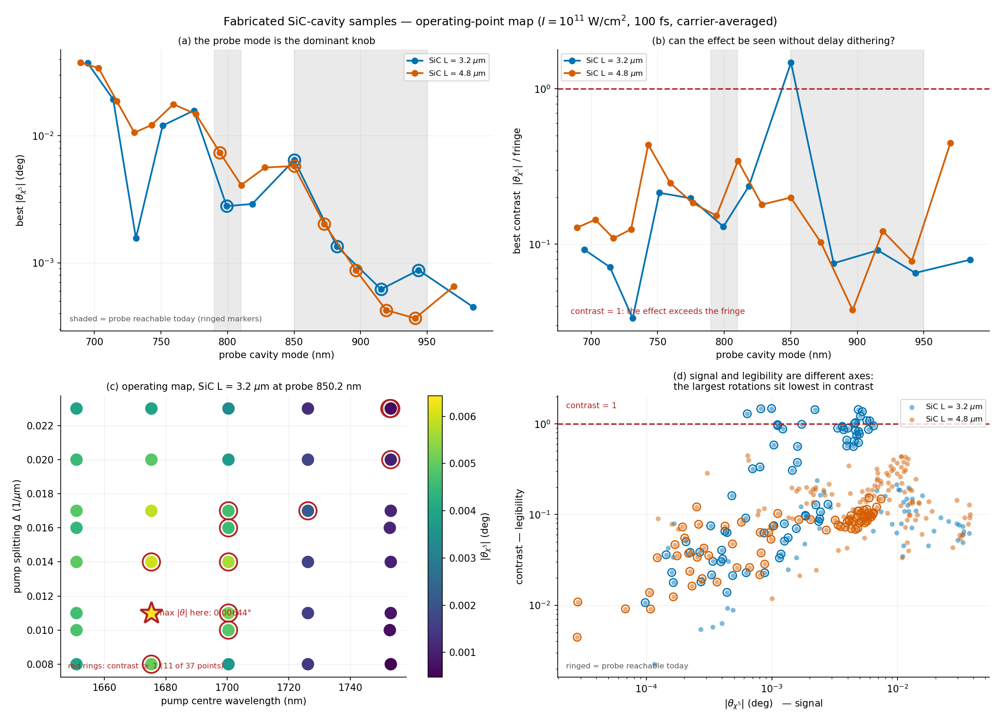
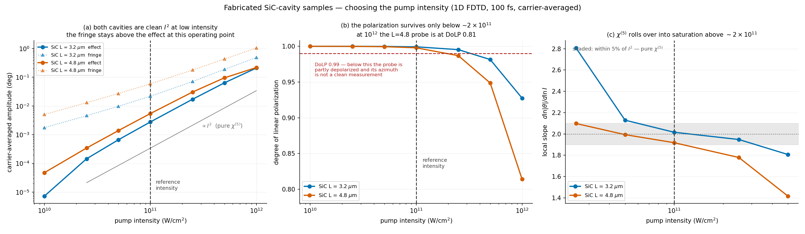

# Fabricated SiC-cavity samples — what to run, what to expect, and whether you'll see it

*Carrier-averaged, pulse-integrated rotation; 100 fs intensity FWHM.*
*Complete: 1640 simulations — intensity ladder, 312-point operating map, delay trace, 24 3D MPI runs.*
*⚠️ 3D REVERSES the 1D ranking on both axes — read §7 before using §4.*

---

## 1. The three answers, up front

> ⚠️ **These conclusions come from 3D. The 1D map (§4) points the opposite way** — see §7 for why,
> and do not use the 1D contrast column to choose an operating point.

### Sample **SiC L = 4.8 µm** — put this one on the bench

> **probe 794.2 nm · pump₁ 1515.2 nm · pump₂ 1569.9 nm (centre 1542.0, Δ = 0.0230 µm⁻¹)**
> **pump intensity 1×10¹¹ W/cm² per pump**
> → **θ_χ5 = 0.074° (3D)**, carrier fringe 0.047°, **contrast 1.59**, DoLP 0.72

**This is the only operating point in either sample where the χ⁽⁵⁾ effect exceeds the carrier
fringe in 3D**, and it is at a probe wavelength you can already reach. It gains **10.1×** from
1D to 3D, the largest enhancement in the campaign.

At contrast 1.59 the delay oscillation rides on a DC offset **larger than its own amplitude**, so
the trace never crosses zero — the χ⁽⁵⁾ signal is a visible feature of the raw scan, not
something recovered from it. The carrier-phase average is still the clean way to *quantify*
θ_χ5, but you no longer need it merely to *see* the effect.

**If the probe is later extended below 790 nm:** probe 759.4 nm, pumps 1492.5/1545.6 nm
(Δ = 0.0230) gives **θ = 0.120° in 3D** — 1.6× more signal — at contrast 0.91, just under the
line. Worth it only if you keep the dither procedure.

### Sample **SiC L = 3.2 µm** — do not use it

> best 3D: probe 850.2 nm → θ = 0.017°, fringe 0.25°, **contrast 0.07**

4.3× less rotation and 23× worse contrast than L=4.8. Its apparent 1D advantage does not survive
the third dimension (§7).

### ⚠️ Do not chase the short-probe modes
The largest 1D rotations sit at 689–695 nm, and in 3D L=4.8 reaches 0.339° there. **That number
is not usable: DoLP falls to 0.40**, i.e. the probe is half-depolarized and its azimuth is not a
rotation measurement (§7). Both short-probe finalists fail this way; both look fine in 1D.

### ⚠️ Pump these ~10× weaker than the SiN sample

At **10¹² W/cm²** — the intensity your SiN sample runs at — the L=4.8 probe comes back at
**DoLP 0.81** with a log-log slope of **1.42**. That is the large-signal regime: the azimuth is
no longer a well-defined polarization rotation and θ ∝ I² has broken down. **Use ~10¹¹ W/cm².**

---

## 2. What the samples are

```
Air | [SiN 237.5 / SiO₂ 344.2 nm] ×3 | SiC cavity (3.2 or 4.8 µm) | [SiO₂ / SiN] ×3 | SiO₂ sub
```

SiC replaces **only the cavity spacer**; the mirrors are the fabricated `best_absolute` SiN/SiO₂
stack, unchanged. Both media are nonlinear — SiC n₂ = 5×10⁻¹⁸ m²/W, SiN mirrors 5×10⁻¹⁹.

| | optical n·L @1.55 µm | stack | stopband (R>0.8) |
|---|---|---|---|
| SiN L=5.894 µm (earlier sample) | 12.04 µm | 8.38 µm | 1685–2281 nm |
| SiC L=3.2 µm | 8.18 µm | 6.69 µm | 1713–2403 nm |
| SiC L=4.8 µm | 12.28 µm | 8.29 µm | 1694–2322 nm |

L=4.8 is within 2% of the SiN sample optically, so its mode comb is nearly the same — but with
~10× the nonlinearity where the field is strongest.

⚠️ **The SiC n₂ = 5×10⁻¹⁸ m²/W is not a measured or literature value** — it is flagged
"user-specified" in the code. θ_χ5 scales roughly as n₂², so a factor *f* error in n₂ moves every
rotation here by ≈ *f*². Rescale accordingly; **contrast and the choice of operating point are
much less sensitive**, since effect and fringe both grow with n₂.

---

## 3. How much better than the SiN sample?

Two honest framings, because the SiC samples cannot be pumped as hard:

| | equal intensity (material gain) | as operated (SiC @10¹¹ vs SiN @10¹²) |
|---|---|---|
| L=3.2, best reachable today | **179×** | 1.83× as-fabricated, 0.78× SiN's best retune |
| L=4.8, best reachable today | **205×** | 2.10× as-fabricated, 0.90× SiN's best retune |
*(1D-vs-1D. The short-probe rows are omitted — those operating points fail on DoLP in 3D, §7.)*

The equal-intensity column is the physics — ~10² –10³×, consistent with a 10× n₂ entering an
effectively χ⁽⁵⁾ process, discounted because only the cavity is SiC. The as-operated column is
what you will actually measure, and it is the one that matters for planning.

**In 1D** the SiC samples are ~2× the as-fabricated SiN sample with today's probe. **But the 3D
numbers are what count** (§7): L=4.8 at 794.2 nm gives **0.074° in 3D**, i.e. **21× the SiN
sample's as-fabricated 1D value and 9.1× its best retune** — and unlike SiN it clears contrast 1.
The table above is 1D-vs-1D and understates the advantage.

---

## 4. Full operating-point maps



Best achievable at each probe cavity mode, I = 10¹¹ W/cm²:

**SiC L = 3.2 µm** (128 operating points)

| probe (nm) | Q | T | θ_χ5 (deg) | fringe | contrast | reach |
|---|---|---|---|---|---|---|
| 695.0 | 238 | 0.49 | **0.03724** | 0.598 | 0.06 | future |
| 714.1 | 130 | 0.79 | 0.01935 | 0.294 | 0.07 | future |
| 751.3 | 83 | 0.87 | 0.01203 | 0.095 | 0.13 | future |
| 774.7 | 84 | 0.90 | 0.01577 | 0.097 | 0.16 | future |
| 799.4 | 69 | 0.94 | 0.00279 | 0.022 | 0.13 | **NOW** |
| **850.2** | **69** | **0.92** | **0.00644** | **0.0068** | **0.95** | **NOW** |
| 882.2 | 65 | 0.95 | 0.00135 | 0.024 | 0.06 | NOW |
| 915.4 | 56 | 0.97 | 0.00062 | 0.0068 | 0.09 | NOW |
| 943.6 | 55 | 0.97 | 0.00088 | 0.038 | 0.02 | NOW |

**SiC L = 4.8 µm** (184 operating points)

| probe (nm) | Q | T | θ_χ5 (deg) | fringe | contrast | reach |
|---|---|---|---|---|---|---|
| 689.5 | 321 | 0.30 | **0.03764** | 0.375 | 0.10 | future |
| 703.1 | 244 | 0.52 | 0.03409 | 0.371 | 0.09 | future |
| 742.9 | 102 | 0.84 | 0.01213 | 0.030 | **0.41** | future |
| 759.4 | 114 | 0.83 | 0.01770 | 0.127 | 0.14 | future |
| 776.3 | 110 | 0.87 | 0.01479 | 0.111 | 0.13 | future |
| **794.2** | 94 | 0.91 | **0.00739** | 0.050 | 0.15 | **NOW** |
| 810.3 | 85 | 0.92 | 0.00409 | 0.012 | 0.34 | future |
| 850.0 | 91 | 0.91 | 0.00577 | 0.031 | 0.19 | NOW |
| 872.6 | 89 | 0.92 | 0.00203 | 0.023 | 0.09 | NOW |

### ⚠️ The most striking 1D result — which 3D overturns
Both cavities have a mode at ~850 nm. **In 1D** contrast there is 0.95–1.08 on L=3.2 and 0.19 on
L=4.8 — same wavelength, same mirrors, same material, ~5× difference from cavity length alone.
**In 3D this reverses** (§7): L=3.2 falls to 0.05–0.07 and L=4.8 rises to 1.59. The mechanism is
real but the cancellation it describes is fragile to the transverse dimension — it is the
fringe-suppression effect documented in
[`../../chi5_dbr_design/docs/fringe_vs_effect.md`](../../chi5_dbr_design/docs/fringe_vs_effect.md):
the effect (k=0, a sum of positive-definite intensity products) cannot cancel, but the fringe
(k=±1) can be made to interfere destructively, and whether it does depends on the geometry.

At 850.2 nm on L=3.2, **11 of 37 operating points clear contrast ≥ 1** — a real region, not a
single lucky grid point. The region is *patchy* rather than contiguous, so tuning matters;
panel (c) of the figure maps it.

---

## 5. Intensity — where the measurement is still χ⁽⁵⁾



| I (W/cm²) | L=3.2 θ / slope / DoLP | L=4.8 θ / slope / DoLP |
|---|---|---|
| 5×10¹⁰ | 0.00067° / 2.13 / 0.9998 | 0.00139° / 1.99 / 0.9995 |
| **1×10¹¹** | **0.00277° / 2.02 / 0.9993** | **0.00544° / 1.92 / 0.9979** |
| 2.5×10¹¹ | 0.01709° / 1.95 / 0.9953 | 0.03048° / 1.78 / 0.9869 |
| 5×10¹¹ | 0.06373° / 1.81 / 0.9815 | 0.09537° / 1.42 / **0.9486** |
| 1×10¹² | 0.20927° / — / **0.9274** | 0.21739° / — / **0.8139** |

*(measured at the FWM-matched ~800 nm point of each sample; slope is the local d ln|θ| / d ln I)*

**Operating window: ≤ 2×10¹¹ W/cm².** L=3.2 tolerates more intensity than L=4.8 — a shorter
cavity accumulates less nonlinear phase. If you need more signal than 10¹¹ gives, L=3.2 can be
pushed to ~2.5×10¹¹ (slope 1.95, DoLP 0.995) where it yields 0.017°.

Contrast *improves* with intensity (effect ∝ I², fringe ∝ I^1.2–1.7), so there is a genuine
trade: more intensity buys legibility at the cost of polarization purity.

---

## 6. The predicted delay trace

312 sims: 6 finalists × 13 envelope delays (±150 fs, step 25) × 4 carrier phases, at fixed
350 fs source pad so run length does not vary with τ.

**Cross-validation:** at τ = 0 the delay stage gives **0.006104°** for the recommended point
against **0.00600°** from the operating-point scan — **1.7% agreement between two independently
run stages at different source pads** (25 fs vs 350 fs). The readout is reproducible.

| τ (fs) | L=3.2 legible: effect / fringe / contrast | L=4.8 nowbest: effect / fringe / contrast |
|---|---|---|
| −100 | 0.0019 / 0.0012 / *1.61* | 0.0003 / 0.0232 / 0.01 |
| −50 | 0.0040 / 0.0062 / 0.65 | 0.0039 / 0.0453 / 0.09 |
| −25 | 0.0043 / 0.0058 / 0.75 | 0.0063 / 0.0512 / 0.12 |
| **0** | **0.0061 / 0.0060 / 1.02** | 0.0074 / 0.0495 / 0.15 |
| +25 | 0.0056 / 0.0069 / 0.81 | 0.0067 / 0.0411 / 0.16 |
| +50 | 0.0046 / 0.0085 / 0.55 | 0.0048 / 0.0303 / 0.16 |
| +100 | 0.0019 / 0.0054 / 0.35 | 0.0009 / 0.0137 / 0.07 |

*Italic entries are where both channels are near the N=4 residual floor and the ratio is noisy —
do not read the 1.61 and 2.57 excursions as real.*

Effect envelope FWHM ≈ **125 fs** (L=3.2) and **100 fs** (L=4.8), matching the pump–pump
intensity cross-correlation as the χ⁽⁵⁾ picture requires.

⚠️ **The key qualification:** contrast peaks at τ = 0 and falls away on both sides — median 0.75
over |τ| ≤ 50 fs. Contrast ≥ 1 is a property of exact pulse coincidence, not of the whole scan.
On L=4.8 contrast is flat at 0.15 everywhere: the fringe dominates at every delay.

## 7. ⭐ 3D REVERSES THE 1D RANKING — on both axes

24 MPI jobs × 24 ranks, res 30, decay 1e-3, ~3.0 h each.

All 24 jobs complete (6 finalists × 4 carrier phases):

| finalist | probe | θ_1D | **θ_3D** | 3D/1D | fringe_3D | contrast 1D → **3D** | DoLP_3D |
|---|---|---|---|---|---|---|---|
| **L4p8 nowbest** | **794.2 nm** | 0.00739° | **0.07448°** | **10.08×** | 0.0469° | 0.15 → **1.59** | 0.715 |
| L4p8 legible_fb | 759.4 nm | 0.01401° | 0.11985° | 8.55× | 0.1320° | 0.25 → 0.91 | 0.768 |
| L3p2 legible | 850.2 nm | 0.00600° | 0.01715° | 2.86× | 0.2511° | 1.08 → **0.07** | 0.820 |
| L3p2 nowbest | 850.2 nm | 0.00644° | 0.01455° | 2.26× | 0.2945° | 0.95 → **0.05** | 0.819 |
| ~~L4p8 maxsignal~~ | 689.5 nm | 0.03764° | *0.33929°* | 9.01× | 1.0785° | 0.10 → 0.31 | **0.403** ⚠️ |
| ~~L3p2 maxsignal~~ | 695.0 nm | 0.03724° | *0.03582°* | 0.96× | 0.7914° | 0.06 → 0.05 | **0.453** ⚠️ |

**In 3D, L=4.8 delivers 4.3× more rotation *and* 23× better contrast than L=3.2.** Both axes flip.

### ⚠️ The two short-probe "max signal" points disqualify themselves
At 689.5 and 695.0 nm the 3D probe returns **DoLP 0.40 and 0.45** — roughly half the 0.65–0.86
that every other design gives at this resolution. The probe emerges substantially depolarized, so
its azimuth is not a meaningful rotation and **the headline 0.339° cannot be quoted**. This is the
same failure mode that disqualified cand07 in the SiN campaign (DoLP 0.233 in 3D), and it is
invisible in 1D, where both points sit at DoLP 0.998.

⇒ **The short-probe/high-signal branch is not merely fringe-dominated — it is not measurable.**

### Why — and the general lesson

L=3.2's **fringe grows 43×** from 1D to 3D (0.0068° → 0.2945°). L=4.8's is essentially unchanged
(0.0497° → 0.0469°). The effect grows in both cases (2.3–2.9× and 10.1×).

The fringe suppression that made L=3.2 look good in 1D was a **delicate destructive-interference
condition among the k=±1 terms** — see
[`../../chi5_dbr_design/docs/fringe_vs_effect.md`](../../chi5_dbr_design/docs/fringe_vs_effect.md).
In 3D the transverse mode structure averages over a spread of propagation angles, and that
cancellation washes out. The k=0 effect, being a sum of positive-definite intensity products, has
no such fragility — which is exactly why it survives and the fringe does not.

> ⚠️ **Contrast optimised in 1D can be an artifact of the plane-wave idealisation.** The SiN
> campaign hinted at this (cand15: 1.32 → 0.59) but here it is a complete reversal. **Any future
> geometry selected on 1D contrast must be re-checked in 3D before fabrication.**

⚠️ 3D DoLP at res 30 runs 0.65–0.86 for every design (measured across the whole SiN campaign) —
that is transverse spatial averaging in the monitor, **not** the large-signal depolarization that
rules out 10¹² W/cm². Do not confuse the two.

⚠️ The delay trace in §6 is **1D**. Its conclusion (contrast ≥ 1 only at τ = 0, for L=3.2) is
superseded by this section: in 3D L=3.2 does not reach contrast 1 at any delay, and L=4.8 exceeds
it. A 3D delay scan was not run — it would cost ~24 × 13 × 3 h.

---

## 8. Constraints and caveats

- **Extending the probe below ~700 nm buys nothing on its own.** A probe mode is usable only if
  its FWM-matched pump (2×λ_probe) is inside 1400–2000 nm. That is a hard floor at λ_probe ≈
  700 nm: modes at 604–658 nm were dropped automatically. Your `[600–900] nm` future window is
  effectively `[700–900] nm` **unless the pump source also extends below 1400 nm**.
- **The 689.5 nm point on L=4.8 is poorly sampled.** Its FWM-matched pump is 1379 nm, *below*
  your floor, so most of its (centre, Δ) grid is cut away and the survivors sit at the edge of
  the pump range, 1.5–3% mismatched. The 0.0376° figure is real but operationally marginal.
- **Readout assumes broadband balanced detection** over ±18 nm around the probe. A bandpass
  narrower than ±14 nm would reject the FWM sidebands and measure something else. *Still an open
  question: is the probe arm spectrally filtered?*
- All rotations are the **carrier-averaged, pulse-integrated** observable — the physical one.
  Single-carrier-phase or tail-window numbers are 1–2 orders of magnitude different and of the
  wrong sign roughly half the time.

---

## 9. Provenance

| | |
|---|---|
| simulations | 56 (intensity) + 1248 (scan) + 312 (delay) + 24 3D = **1640** |
| estimator | carrier-averaged (N=4) pulse-integrated Stokes, 15-bin probe DFT |
| materials | 2-pole Lorentz fits of `sic.csv`, `si3n4.csv`, `sio2.csv` |
| resolution / decay | 1D res 80, decay 1e-4 · 3D res 30, decay 1e-3 |
| data | `runs/s0_intensity/s0_result.json`, `runs/s1_scan/{L3p2,L4p8}/result.json`, `runs/s3_finalists/` |
| reproduce | see [`../README.md`](../README.md) |

The simulator needed a three-material extension to express these samples (a SiC cavity inside
SiN mirrors); the change is additive and the pre-existing SiN pipeline reproduces **bit-identically**.
